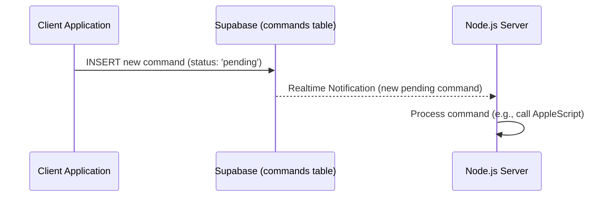

# Epic-1 - Story-1.3
Server - Subscribe to New Commands

**As a** Node.js服务器应用
**I want** 使用Supabase SDK实时订阅`commands`表中`status`为 'pending' 的新记录
**so that** 我可以即时获取并处理用户通过客户端发送的新指令。

## Status

Completed

## Context

- **Background information**: This is a core part of the server's new functionality to replace Redis Pub/Sub.
- **Current state**: Server application might have Redis subscription logic. Data tables `commands` and `results` are defined (US1.1, US1.2).
- **Story justification**: Enables the server to be event-driven, reacting to new commands as they are inserted into the Supabase table by clients.
- **Technical context**: Involves using the Supabase JavaScript (or other relevant) SDK to listen for `INSERT` events on the `commands` table, filtered by `status = 'pending'`.
- **Relevant history from previous stories**: Depends on `commands` table (US1.1) and Supabase client initialization (US1.8).

## Estimation

Story Points: {Story Points (1 SP = 1 day of Human Development = 10 minutes of AI development)}

## Tasks

{
1. - [x] Integrate Supabase SDK into the Node.js server application.
2. - [x] Implement logic to connect to Supabase using the service role key (related to US1.8).
3. - [x] Set up a Supabase realtime subscription for `INSERT` events on the `commands` table.
   1. - [x] Filter subscription to only trigger for records where `status` is 'pending'.
4. - [x] Define a callback function to handle new command data received from the subscription.
5. - [x] Ensure robust error handling for the subscription (e.g., connection drops, Supabase errors).
6. - [x] Basic logging for received commands.
}

## Constraints

- Must use the Supabase SDK's realtime capabilities.
- Subscription should be efficient and not miss new 'pending' commands.
- Adherence to PRD-US1.

## Data Models / Schema

- Reads from the `commands` table (defined in US1.1 and PRD 4.1.1).
- Expects to receive new `commands` record data through the subscription.

## Structure

- Impacts the main server logic in the Node.js application (e.g., `server.js` or a dedicated service module).
- May require a new module for Supabase interactions if not already present.

## Diagrams

## Dev Notes

- Consider the implications of server restarts on active subscriptions and how to re-establish them.
- Review Supabase documentation for best practices on realtime subscriptions and filters.
- The PRD (Section 6, Point 4) recommends: "客户端订阅其创建的commands记录的变化。当status变为 'completed' 或 'error' 时，客户端再根据command_id查询对应的results记录." While this story is server-side, it sets up the event the client will eventually rely on (indirectly, via status changes initiated by server).

## Chat Command Log

{
- User: Generate user stories according to the template.
- Agent: Processing US1.3...
} 