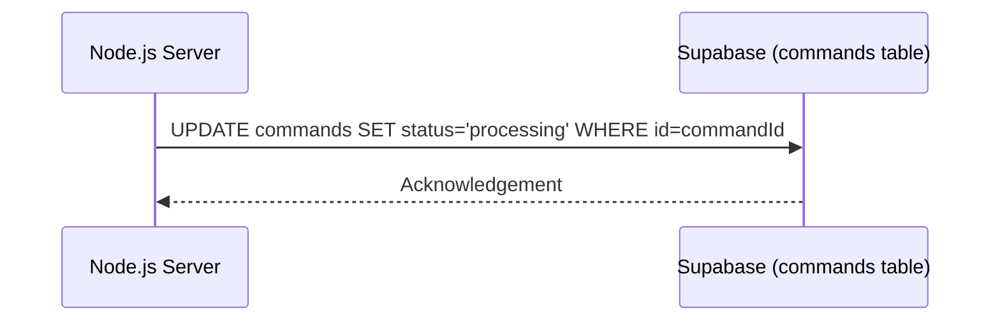

# Epic-1 - Story-1.4
Server - Update Command Status to Processing

**As a** Node.js服务器应用
**I want** 在从`commands`表接收到一个待处理指令后，立即通过Supabase SDK将该指令记录的`status`字段更新为 'processing'
**so that** 系统的其他部分（包括可能的客户端）知道该指令正在被处理中。

## Status

Completed

## Context

- **Background information**: Follows after a new command is picked up by the server (US1.3).
- **Current state**: Server has received a new 'pending' command.
- **Story justification**: Provides a clear state transition for commands, indicating that active processing has begun. This is important for traceability and potential UI updates on the client side.
- **Technical context**: Involves a Supabase SDK `UPDATE` operation on the `commands` table for a specific record ID.
- **Relevant history from previous stories**: Depends on US1.3 (server receiving the command).

## Estimation

Story Points: {Story Points (1 SP = 1 day of Human Development = 10 minutes of AI development)}

## Tasks

{
1. - [x] In the callback function handling new commands (from US1.3), extract the command ID.
2. - [x] Implement a Supabase SDK call to update the `status` of the specific command record to 'processing'.
3. - [x] Add error handling for the update operation (e.g., if the record is not found, or Supabase error).
4. - [x] Log the status update.
}

## Constraints

- The update must happen promptly after a command is picked up for processing.
- Adherence to PRD-US2.

## Data Models / Schema

- Modifies the `status` field of a record in the `commands` table (defined in US1.1 and PRD 4.1.1).

## Structure

- Impacts the server logic within the new command handling callback in the Node.js application.

## Diagrams

## Dev Notes

- This is a relatively straightforward database update.
- Ensure the server has the necessary permissions (service_role key) to perform this update.

## Chat Command Log

{
- User: Generate user stories according to the template.
- Agent: Processing US1.4...
} 