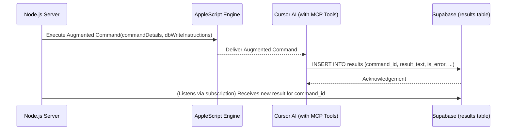

# Epic-1 - Story-1.5
Server - Store Execution Result

**As a** Node.js服务器应用
**I want** 在通过AppleScript执行完一条指令后，能将执行结果（包括`result_text` for success, or `error_message` for failure, and `is_error` flag）通过Supabase SDK作为一条新记录存入`results`表，并确保其通过`command_id`与原始指令正确关联
**so that** 指令的执行产出被持久化，并可供客户端查询。

## Status

Completed

## Context

- **Background information**: This occurs after the server has processed a command via AppleScript.
- **Current state**: Command has been processed by AppleScript, yielding a result or an error.
- **Story justification**: Persists the outcome of the command execution, making it available for clients and for logging/auditing purposes.
- **Technical context**: Involves a Supabase SDK `INSERT` operation into the `results` table.
- **Relevant history from previous stories**: Follows command processing which is initiated after US1.4.

## Estimation

Story Points: {Story Points (1 SP = 1 day of Human Development = 10 minutes of AI development)}

## Tasks

{
1. - [x] After AppleScript execution, determine if it was successful or an error occurred.
2. - [x] Collect `result_text` if successful, or `error_message` if an error occurred.
3. - [x] Set the `is_error` boolean flag accordingly.
4. - [x] Retrieve the original `command_id` for the processed command.
5. - [x] Implement a Supabase SDK call to `INSERT` a new record into the `results` table with `command_id`, `result_text` (or `error_message`), `is_error`, and potentially `raw_result`. (Note: Implemented by delegating the INSERT to Cursor AI via augmented command instructions, which then uses MCP tools.)
6. - [x] Add error handling for the insert operation (e.g., Supabase errors, constraint violations). (Note: Indirectly handled by AI reporting errors into the results table, or server-side errors if AppleScript/Subscription fails.)
7. - [x] Log the storing of the result.
}

## Constraints

- The `command_id` must correctly link to an existing record in the `commands` table.
- Adherence to PRD-US3.

## Data Models / Schema

- Writes to the `results` table (defined in US1.2 and PRD 4.1.2).
- Fields to populate: `command_id`, `result_text`, `error_message`, `is_error`, `raw_result`.

## Structure

- Impacts the server logic in the Node.js application, specifically where AppleScript results are handled.

## Diagrams

## Dev Notes

- The `raw_result` field in the `results` table can be useful for storing the exact, unparsed output from AppleScript/Cursor, especially since PRD states `result_text` format is not fixed.
- Ensure proper mapping of AppleScript success/failure to `is_error` and the respective text fields.
- **Implementation Note**: The actual INSERT into the `results` table is performed by the Cursor AI using its Supabase MCP tools, as instructed by an augmented command from the Node.js server. The server then subscribes to the `results` table to confirm the write and retrieve the result data.

## Chat Command Log

{
- User: Generate user stories according to the template.
- Agent: Processing US1.5...
} 