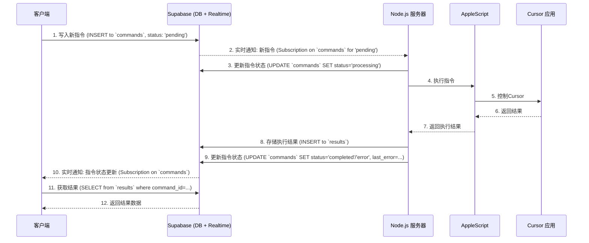

# Architecture for Cursor远程控制解决方案 - Supabase迁移

Status: Draft

## Technical Summary

本文档概述了将Cursor远程控制解决方案的后端从Redis Pub/Sub迁移到Supabase的架构设计。核心目标是利用Supabase的实时数据库替换消息传递机制，并通过其BaaS功能简化后端基础设施，提升安全性和可维护性。迁移将涉及客户端和服务器端的代码调整以适配Supabase SDK，并定义新的数据模型（`commands` 和 `results` 表）来支持现有功能。初期将配置相对宽松的行级安全 (RLS) 策略，暂不实现用户认证。

## Technology Table

| Technology          | Description                                                                 |
|---------------------|-----------------------------------------------------------------------------|
| Supabase            | BaaS平台，提供实时数据库 (PostgreSQL + Realtime) 作为核心通信和数据存储      |
| PostgreSQL          | Supabase 底层的关系型数据库，用于存储 `commands` 和 `results` 数据         |
| Supabase Realtime   | 用于实现客户端和服务器之间的实时消息订阅和更新                               |
| Node.js             | 服务器端应用程序的运行环境                                                    |
| Supabase SDK (JS)   | 用于Node.js服务器和Web客户端与Supabase后端进行交互的JavaScript库          |
| AppleScript         | 用于在Mac上控制Cursor应用程序的脚本语言 (现有组件，逻辑基本不变)              |
| Web 客户端 (TBD)    | 用户交互界面，将使用Supabase SDK与后端通信 (具体技术栈待定，但会包含HTML/CSS/JS) |

## Architectural Diagrams

### 系统概览

```mermaid
graph TD
    subgraph Client Tier
        MobileClient[移动设备客户端]
    end

    subgraph Backend Tier (Supabase)
        SupabaseDB[(Supabase PostgreSQL)]
        SupabaseRealtime[Supabase Realtime API]
        SupabaseFunctions[Supabase Edge Functions (未来可能)]
    end

    subgraph Server Tier (Self-hosted)
        NodeServer[Node.js 服务器]
    end

    subgraph macOS
        AppleScript[AppleScript Engine]
        CursorApp[Cursor 应用]
    end

    MobileClient -- HTTPS/WSS --> SupabaseRealtime
    MobileClient -- HTTPS --> SupabaseDB
    NodeServer -- HTTPS/WSS --> SupabaseRealtime
    NodeServer -- HTTPS --> SupabaseDB
    NodeServer -- IPC/Shell --> AppleScript
    AppleScript -- OS Events --> CursorApp

    SupabaseRealtime -- DB Changes --> SupabaseDB
```

### 命令处理流程



## Data Models, API Specs, Schemas, etc...

数据模型严格遵循 PRD 4.1.1 和 4.1.2 中定义的 `commands` 和 `results` 表。

### `commands` 表

| 字段名        | 类型        | 描述                                     | 约束/备注                                     |
|---------------|-------------|------------------------------------------|-----------------------------------------------|
| id            | UUID        | 主键，唯一标识                           | Supabase自动生成 (PK), `gen_random_uuid()`      |
| created_at    | TIMESTAMPTZ | 创建时间戳                               | Supabase自动生成, `now()`                      |
| command_text  | TEXT        | 命令内容 (用户输入的自然语言)            | NOT NULL                                      |
| status        | TEXT        | 命令状态 ('pending', 'processing', 'completed', 'error') | NOT NULL, 默认 'pending'                 |
| user_id       | UUID        | (可选) 用户标识                           | 占位符，当前可为空                               |
| raw_command   | JSONB       | (可选) 结构化的原始命令数据              |                                               |
| attempts      | INTEGER     | (可选) 重试次数                           | 默认 0                                        |
| last_error    | TEXT        | (可选) 最后一次错误信息                   |                                               |

### `results` 表

| 字段名        | 类型        | 描述                                   | 约束/备注                                     |
|---------------|-------------|----------------------------------------|-----------------------------------------------|
| id            | UUID        | 主键，唯一标识                         | Supabase自动生成 (PK), `gen_random_uuid()`      |
| created_at    | TIMESTAMPTZ | 创建时间戳                             | Supabase自动生成, `now()`                    |
| command_id    | UUID        | 关联的`commands`表中的指令ID           | NOT NULL, FK to `commands.id`                 |
| result_text   | TEXT        | 执行结果内容 (Cursor的直接输出)        |                                               |
| error_message | TEXT        | 错误信息 (如果发生错误)                |                                               |
| is_error      | BOOLEAN     | 标记是否为错误结果                     | NOT NULL, 默认 FALSE                         |
| raw_result    | JSONB       | (可选) 结构化的原始结果数据            |                                               |

### 行级安全 (RLS) 策略初步设想 (基于PRD和用户故事)

**`commands` 表 RLS:**
- **INSERT**: `anon` 和 `authenticated` 角色可以插入。
- **SELECT**:
    - `service_role` 可以读取所有记录。
    - `anon`/`authenticated` 初期可能允许读取所有记录以简化客户端订阅逻辑，或者仅允许读取自己创建的记录 (需要 `user_id` 机制配合，本次迭代不重点实现)。PRD 指出 "初期可能需要更宽松的策略"。
- **UPDATE**:
    - `service_role` 可以更新任何记录 (主要用于服务器更新 `status`, `last_error`, `attempts`)。
- **DELETE**: 初期不允许任何角色删除。

**`results` 表 RLS:**
- **INSERT**: `service_role` 可以插入 (只有服务器能创建结果)。
- **SELECT**:
    - `service_role` 可以读取所有记录。
    - `anon`/`authenticated` 可以读取与他们 `commands` 记录相关联的 `results` 记录。这通常通过一个基于 `command_id` 的检查来实现，该 `command_id` 与用户有权访问的 `commands` 记录相关联。
- **UPDATE**: 初期不允许任何角色更新。
- **DELETE**: 初期不允许任何角色删除。

*注意: 上述RLS策略是初步的，具体实现细节和SQL定义将在开发过程中根据US4.5和US4.6进一步细化。当前版本不实现用户认证，因此`anon`和`authenticated`角色的区分以及`user_id`的使用将保持简单或作为占位符。*

## Project Structure

由于主要变更是后端通信机制和部分服务器/客户端逻辑，现有项目结构中主要影响的是服务器端和客户端与数据交互的部分。

```
CursorRemote/
├── client/                   # 现有客户端代码，将进行修改以集成Supabase SDK
│   └── ...
├── server/                   # 现有Node.js服务器代码
│   ├── src/
│   │   ├── services/         # 可能的服务层
│   │   │   └── supabaseService.js # (新增) 封装Supabase交互逻辑
│   │   ├── controllers/      # 可能的控制器层
│   │   │   └── commandController.js # (修改) 处理指令逻辑，与Supabase交互
│   │   └── appleScriptRunner.js # (现有) 执行AppleScript的模块，基本不变
│   ├── test/                 # 服务器端测试
│   ├── .env.example          # 环境变量示例 (包含SUPABASE_URL, SUPABASE_SERVICE_KEY)
│   └── package.json
├── .ai/                      # AI辅助开发相关文档
│   ├── prd.md
│   ├── architecture.md       # (本文档)
│   └── stories/              # 用户故事
│       └── ...
├── scripts/                  # 辅助脚本
├── docs/                     # 项目文档
└── README.md
```
*说明: 上述结构是基于对现有项目的推断和本次迁移影响的预测。具体文件和目录结构可能根据实际情况调整。核心变化在于 `server` 端会引入Supabase SDK并调整数据处理逻辑，`client` 端同样需要集成SDK。*

## Infrastructure

- **Supabase Cloud**: 项目将依赖Supabase提供的云服务，包括PostgreSQL数据库、Realtime服务、可能的Auth服务（未来）和存储服务（未来）。
    - Supabase项目需要创建。
    - 数据库表 (`commands`, `results`) 需要根据上述模式创建。
    - RLS策略需要配置。
    - 实时功能需要为 `commands` 和 `results` 表启用。
- **Node.js Server Hosting**: 现有的Node.js服务器的托管环境保持不变 (例如，本地Mac机器或其他服务器)。服务器需要能够访问公网的Supabase API。
- **Client Hosting**: 客户端的托管方式保持不变。

## Deployment Plan

1.  **Supabase Setup (US4.1, US4.2, US4.7):**
    *   在Supabase云平台创建新项目。
    *   根据定义在Supabase项目中创建 `commands` 和 `results` 表，配置字段、类型、约束和外键。
    *   为 `commands` 和 `results` 表启用实时 (Realtime) 功能。
2.  **API Keys Configuration (US4.3, US4.4):**
    *   获取Supabase项目的 `SUPABASE_URL`。
    *   为Node.js服务器生成并配置 `SUPABASE_SERVICE_KEY` (通过环境变量)。
    *   为Web客户端配置 `SUPABASE_ANON_KEY` (通常在客户端代码中直接使用或通过构建过程注入)。
3.  **Server-Side Migration (Epic 1):**
    *   在Node.js服务器项目中集成Supabase SDK (`@supabase/supabase-js`) (US1.8)。
    *   修改服务器逻辑，使用Supabase SDK替换Redis Pub/Sub：
        *   订阅`commands`表中的新 `'pending'` 指令 (US1.3)。
        *   接收到指令后，更新其在`commands`表中的状态为`'processing'` (US1.4)。
        *   执行指令（通过AppleScript）。
        *   将执行结果（成功或失败）记录到`results`表 (US1.5)。
        *   更新`commands`表中对应指令的状态为`'completed'`或`'error'`，并记录`last_error` (US1.6)。
        *   实现健壮的错误处理 (US1.7)。
4.  **Client-Side Migration (Epic 2):**
    *   在客户端项目中集成Supabase SDK (US2.1)。
    *   修改客户端逻辑，使用Supabase SDK替换Redis Pub/Sub：
        *   将用户指令写入Supabase的`commands`表，状态为`'pending'` (US2.2)。
        *   实时订阅`commands`表的状态变化以接收指令完成通知 (US2.3)。
        *   当指令状态变为`'completed'`或`'error'`时，从`results`表获取结果并展示给用户 (US2.4, US2.5)。
5.  **RLS Configuration (US4.5, US4.6):**
    *   在Supabase项目中为`commands`和`results`表配置初步的行级安全 (RLS) 策略。
6.  **Testing (Epic 3):**
    *   进行端到端测试，验证所有核心功能（聊天、执行动作等）在新架构下正常工作 (US3.1, US3.2)。
    *   测试错误处理流程 (US3.3)。
7.  **Documentation Update:**
    *   更新项目相关文档以反映新的架构和设置。

## Security Considerations

- **Supabase API Keys**:
    - `SUPABASE_SERVICE_KEY` 具有完全权限，必须仅在服务器端安全存储和使用，绝不能暴露给客户端。推荐使用环境变量。
    - `SUPABASE_ANON_KEY` 是公开的，用于客户端的匿名访问，其权限由RLS策略严格控制。
- **Row Level Security (RLS)**: RLS是Supabase中数据安全的核心。必须仔细设计和测试RLS策略，以确保用户只能访问他们被授权的数据。虽然本次迭代初期RLS策略较为宽松且不区分用户，但未来的用户认证和数据隔离将高度依赖RLS。
- **Input Validation**: 服务器端应始终对来自客户端的输入（如 `command_text`）进行校验，以防止潜在的安全风险（如注入攻击，尽管AppleScript的执行环境可能限制此类风险）。
- **Error Handling**: 详细的错误信息不应直接暴露给客户端，以避免泄露过多系统内部细节。客户端应展示用户友好的错误提示。
- **HTTPS**: 所有与Supabase的通信都通过HTTPS进行，确保传输层安全。
- **AppleScript Security**: AppleScript的执行权限和范围应被控制，避免执行任意或恶意的脚本。Node.js服务器作为中间层，应确保只执行预期的、合法的AppleScript命令。

## Scalability Considerations

- **Supabase**: Supabase 本身设计为可伸缩的BaaS平台。其数据库和实时服务能够处理一定程度的并发和数据量增长。
- **Node.js Server**: 当前的Node.js服务器是单实例运行。如果未来用户量和指令量大幅增加，可能需要考虑：
    - **Statelessness**: 确保服务器是无状态的，以便于水平扩展（运行多个实例）。
    - **Load Balancing**: 在多个服务器实例前增加负载均衡器。
    - **Database Connections**: Supabase的连接池管理。
- **Realtime Subscriptions**: 大量并发的实时订阅可能会对Supabase Realtime服务的性能产生影响。需要监控并可能根据Supabase的建议进行优化。
- **Data Volume**: `commands` 和 `results` 表的数据量会随时间增长。未来可能需要考虑数据归档或清理策略。
- **初期关注点**: 本次迁移主要目标是功能实现和替换Redis，初期不针对大规模并发进行设计，满足个人使用需求。PRD明确指出"初期为个人使用设计，暂不考虑大规模并发或数据量"。

## Maintainability Considerations

- **Modular Design**:
    - 在服务器端，将Supabase的交互逻辑封装到专门的服务模块中（如 `supabaseService.js`），使主业务逻辑（如 `commandController.js`）更清晰。
    - 客户端也应有类似的数据服务层来处理与Supabase的通信。
- **Configuration Management**: 将Supabase的URL和API密钥等配置信息外部化（如使用 `.env` 文件），而不是硬编码在代码中。
- **Clear RLS Policies**: RLS策略应有清晰的文档记录，解释其目的和逻辑。
- **Logging**: 在服务器端和客户端添加适当的日志记录，以便于调试和监控。
- **Code Comments**: 对关键的逻辑和Supabase交互代码添加注释。
- **Supabase SDK**: 使用官方SDK可以简化开发并受益于其持续的维护和更新。
- **PRD Alignment**: 架构设计紧密遵循PRD，确保需求被正确实现。

## Understanding & Consistency

- 本文档旨在提供一个清晰、一致的架构蓝图，供开发团队参考。
- Mermaid图用于可视化系统组件交互和数据流。
- 数据模型直接从PRD引用，确保一致性。
- 项目结构提供了一个建议的组织方式，促进代码的模块化和可理解性。
- 技术选型基于PRD的要求和行业标准实践。

## UML Diagrams / User Interface

- **UML**: 上述的序列图和组件图（使用Mermaid）是主要的UML风格图表。更详细的类图或状态图可以根据需要在具体模块设计时添加。
- **User Interface (UI)**: PRD 指出"对客户端UI/UX进行重大修改"是范围外。因此，UI的核心交互流程将保持不变，仅做必要的适配以展示来自Supabase的数据和错误信息。UI层面的具体设计细节不在此架构文档中详述，但客户端需要能够：
    - 发送指令。
    - 接收并展示指令的实时状态更新。
    - 展示指令执行成功的结果。
    - 展示指令执行失败的错误信息。

## Change Log

- YYYY-MM-DD: 初始草稿创建 - 基于 `prd.md` (版本 X.Y.Z) 和用户故事。 