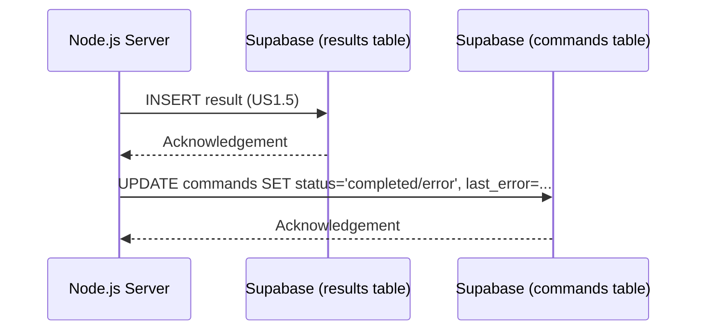

# Epic-1 - Story-1.6
Server - Update Command Status to Completed/Error

**As a** Node.js服务器应用
**I want** 在指令执行完毕并将结果成功存入`results`表之后，通过Supabase SDK将`commands`表中对应指令记录的`status`字段更新为 'completed' (如果成功) 或 'error' (如果失败)，同时如果失败则更新`last_error`字段
**so that** 客户端和其他系统部分可以准确了解指令的最终执行状态。

## Status

Draft

## Context

- **Background information**: This is the final step in the server-side processingofType a command.
- **Current state**: Command execution result has been stored in the `results` table (US1.5).
- **Story justification**: Marks the command lifecycle as finished and makes its final status (and any final error) available for client-side subscriptions on the `commands` table.
- **Technical context**: Involves a Supabase SDK `UPDATE` operation on the `commands` table.
- **Relevant history from previous stories**: Depends on US1.5 (result stored).

## Estimation

Story Points: {Story Points (1 SP = 1 day of Human Development = 10 minutes of AI development)}

## Tasks

{
1. - [ ] After successfully inserting a record into the `results` table (from US1.5), get the `command_id` and the success/error status (`is_error` and `error_message` from the result).
2. - [ ] Determine the final `status` for the `commands` table: 'completed' if `is_error` is false, 'error' if `is_error` is true.
3. - [ ] If an error occurred, prepare the `error_message` to be stored in `commands.last_error`.
4. - [ ] Implement a Supabase SDK call to `UPDATE` the corresponding record in the `commands` table, setting its `status` and, if applicable, `last_error`.
5. - [ ] Add error handling for this update operation.
6. - [ ] Log the final status update of the command.
}

## Constraints

- This update should accurately reflect the outcome stored in the `results` table.
- Adherence to PRD-US4.

## Data Models / Schema

- Modifies the `status` and `last_error` fields of a record in the `commands` table (defined in US1.1 and PRD 4.1.1).

## Structure

- Impacts the server logic in the Node.js application, immediately following the storing of results.

## Diagrams

## Dev Notes

- This update to the `commands` table is what clients will be primarily subscribing to for real-time updates on command completion, as per PRD (Section 6, Point 4).
- Ensure atomicity or at least robust error handling if the chain of operations (store result -> update command status) could be interrupted, though for this scope, sequential operations with good error checks should suffice.

## Chat Command Log

{
- User: Generate user stories according to the template.
- Agent: Processing US1.6...
} 