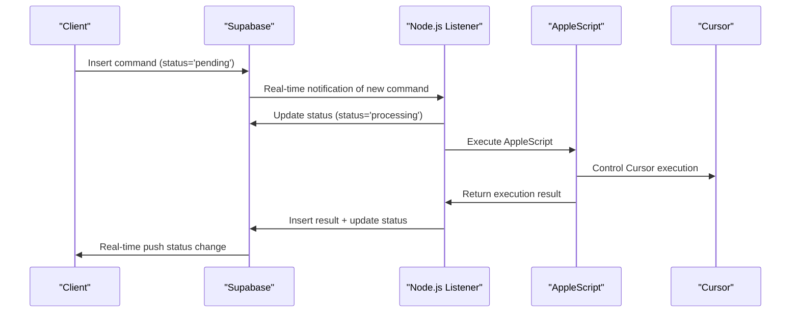

# Cursor Remote Control Project
> A Supabase-based serverless remote control solution for controlling Cursor applications from mobile phones.

[](https://github.com/terryso/cursor_remote/stargazers)
[](https://github.com/terryso/cursor_remote/pulls)
[](https://opensource.org/licenses/MIT)
[](https://deepwiki.com/terryso/cursor_remote)

[阅读中文版 (Read in Chinese)](README.md)

## 📁 Project Structure & Reading Guide

### 🎯 Understanding This Project - Where to Start

This project consists of multiple components and extensive documentation. Here's your roadmap to understanding everything, **ranked by importance (1-10 scale)**:

### 📋 **Essential Reading (Start Here)**

| **Rank** | **Component** | **Path** | **Purpose** | **When to Read** |
|----------|---------------|----------|-------------|------------------|
| **🔟** | **Product Requirements** | [`docs-en/requirements/PRODUCT_REQUIREMENTS.md`](docs-en/requirements/PRODUCT_REQUIREMENTS.md) | Complete project overview, goals, and technical solution | **READ FIRST** - Understand what this project does |
| **9️⃣** | **Architecture Overview** | [`docs-en/COMPLETE_ARCHITECTURE.md`](docs-en/COMPLETE_ARCHITECTURE.md) | Complete system architecture, data flow, and technical design | **READ SECOND** - Understand how it works |
| **8️⃣** | **User Stories** | [`docs-en/requirements/USER_STORIES.md`](docs-en/requirements/USER_STORIES.md) | 29 detailed user stories across 4 epics with acceptance criteria | **READ THIRD** - Understand what features exist |

### 🛠️ **Implementation & Setup**

| **Rank** | **Component** | **Path** | **Purpose** | **When to Read** |
|----------|---------------|----------|-------------|------------------|
| **7️⃣** | **Database Setup** | [`docs-en/deployment/SETUP_DATABASE.md`](docs-en/deployment/SETUP_DATABASE.md) | Step-by-step Supabase database configuration | **Before setup** - Required for running the app |
| **6️⃣** | **Epic Breakdown** | [`docs-en/requirements/EPICS_BREAKDOWN.md`](docs-en/requirements/EPICS_BREAKDOWN.md) | Detailed technical implementation guide (732 lines) | **For developers** - How to build features |
| **5️⃣** | **Client Code** | [`client/`](client/) | Web application (HTML, CSS, JS) for mobile control | **For frontend work** - The user interface |
| **4️⃣** | **Server Code** | [`server/`](server/) | Node.js service that controls Cursor via AppleScript | **For backend work** - Command processing |

### 🔧 **Maintenance & Debugging**

| **Rank** | **Component** | **Path** | **Purpose** | **When to Read** |
|----------|---------------|----------|-------------|------------------|
| **3️⃣** | **Testing Guide** | [`docs-en/testing/BROWSER_TEST_GUIDE.md`](docs-en/testing/BROWSER_TEST_GUIDE.md) | How to test the complete system | **When debugging** - Verify everything works |
| **2️⃣** | **Deployment Status** | [`docs-en/deployment/DEPLOYMENT_STATUS.md`](docs-en/deployment/DEPLOYMENT_STATUS.md) | Current deployment state and troubleshooting | **When issues occur** - Current system status |
| **1️⃣** | **Fix Documentation** | [`docs-en/fixes/`](docs-en/fixes/) | Historical bug fixes and improvements | **Reference only** - When encountering similar issues |

### 🗂️ **Directory Structure Explained**

```
cursor_remote/
├── 📱 client/                    # Web application (mobile interface)
│   ├── index.html               # Main application page
│   ├── app.js                   # Core application logic
│   ├── env-config.js            # Supabase configuration
│   └── tests/                   # Client-side testing tools
│
├── 🖥️ server/                    # Node.js backend service  
│   ├── src/services/            # Core service logic
│   ├── auto-restart.js          # Automatic restart functionality
│   ├── connection-monitor.js    # Connection health monitoring
│   └── package.json             # Node.js dependencies
│
├── 🗄️ database/                  # Database schema and functions
│   ├── tables.sql               # Supabase table definitions
│   ├── functions.sql            # Database RPC functions
│   └── README.md                # Database documentation
│
├── 📚 docs-en/                   # English documentation (COMPLETE)
│   ├── requirements/            # Product & technical requirements
│   ├── deployment/              # Setup and deployment guides  
│   ├── fixes/                   # Bug fixes and improvements
│   ├── testing/                 # Testing procedures
│   └── refactoring/             # Architecture improvements
│
├── 📚 docs-ch/                   # Chinese documentation (original)
│   └── [同样的结构]              # Same structure as docs-en/
│
├── 🔧 scripts/                   # Utility and maintenance scripts
│   ├── maintenance/             # System maintenance tools
│   └── check-*.js               # Health check scripts
│
└── 📄 Configuration Files
    ├── package.json             # Project dependencies and scripts
    ├── .env.example             # Environment variable template
    └── vercel.json              # Deployment configuration
```

### 🎯 **Quick Start Reading Path**

**For New Users (30 minutes):**
1. [`docs-en/requirements/PRODUCT_REQUIREMENTS.md`](docs-en/requirements/PRODUCT_REQUIREMENTS.md) (10 min)
2. [`docs-en/deployment/SETUP_DATABASE.md`](docs-en/deployment/SETUP_DATABASE.md) (15 min) 
3. [`docs-en/testing/BROWSER_TEST_GUIDE.md`](docs-en/testing/BROWSER_TEST_GUIDE.md) (5 min)

**For Developers (2 hours):**
1. Read "New Users" path above
2. [`docs-en/COMPLETE_ARCHITECTURE.md`](docs-en/COMPLETE_ARCHITECTURE.md) (45 min)
3. [`docs-en/requirements/USER_STORIES.md`](docs-en/requirements/USER_STORIES.md) (30 min)
4. [`docs-en/requirements/EPICS_BREAKDOWN.md`](docs-en/requirements/EPICS_BREAKDOWN.md) (45 min)

**For Contributors:**
- Read "Developers" path above
- Review relevant files in [`docs-en/fixes/`](docs-en/fixes/) for context
- Check [`docs-en/refactoring/`](docs-en/refactoring/) for architecture decisions

---

## 🏗️ Architecture Upgrade Notice
**Important Update**: The project has **completed the full migration from Redis to Supabase**, implementing a completely Supabase-based serverless architecture that is more secure, simple, and stable.

📖 **Complete Documentation**: See [Complete Architecture Document](docs/COMPLETE_ARCHITECTURE.md) for detailed architecture design.

📚 **Documentation Hub**: Check [Documentation Center](docs/README.md) for complete document structure and organization.

📋 **Requirements Documentation**: Visit [Requirements Documentation Center](docs/requirements/README.md) for complete product requirements, user stories, and technical specifications.

## 🚨 Quick Start
If you are setting up this project for the first time:

### 📚 Understanding the Project
1. **Project Background**: Read [Requirements Documentation Guide](docs/requirements/README.md) to understand project background and goals
2. **Architecture Overview**: Read [Complete Architecture Document](docs/COMPLETE_ARCHITECTURE.md) to understand system design
3. **Technical Implementation**: Check [User Stories and Epic Breakdown](docs/requirements/USER_STORIES.md) to understand feature implementation

### ⚙️ Environment Configuration
1. **Database Setup**: Follow [Database Setup Guide](docs/deployment/SETUP_DATABASE.md) to configure Supabase database
2. **Deployment Status**: Check [Deployment Status](docs/deployment/DEPLOYMENT_STATUS.md) to understand current configuration
3. **Testing Verification**: Refer to [Browser Testing Guide](docs/testing/BROWSER_TEST_GUIDE.md) to verify functionality

## Live Demo
[https://cursor-remote.vercel.app/](https://cursor-remote.vercel.app/)

### 🔍 **New Feature: Integrated Multiple MCP Services**
The demo server now includes multiple MCP functionalities, allowing you to test various capabilities directly!

#### 🔍 Tavily Search Service
**Test Suggestions**:
- Try asking: "Latest trends and breakthroughs in global AI development for 2025"
- Or: "Application cases and effectiveness analysis of quantum computing in the financial industry"
- Or: "Key technological breakthroughs of ChatGPT-5 and differences from previous generations"

#### 🐍 Python Code Execution Service
**Test Suggestions**:
- Try asking: "Help me generate a Python function to calculate the area of a circle, and execute it using the execute_code tool for a circle with radius 10 cm"
- Or: "Generate the first 20 terms of a Fibonacci sequence using Python and execute it"

The system will automatically use the appropriate MCP services to fetch the latest information or execute code and return results.

## Demo Video 🎬
> Remote control Cursor for UI automation testing

[](https://youtu.be/3SWj7X-4Gzs)

## ✨ Key Features

### 🎮 Remote Control
- **Command Sending**: Send text commands from your phone to Cursor/VS Code
- **Smart Suggestions**: Auto-completion based on command history
- **Real-time Feedback**: Live display of command execution status

### 📊 System Monitoring
- **Connection Status**: Real-time Supabase connection status display
- **System Metrics**: CPU and memory usage monitoring
- **Performance Analytics**: Response time and success rate statistics

### 📝 History Management
- **Command History**: View and manage all historical commands
- **Search & Filter**: Quickly search for specific historical commands
- **Delete Function**: Clean up unwanted history records

### 🔧 Diagnostic Tools
- **Connection Testing**: One-click Supabase connection issue detection
- **Status Dashboard**: Multi-tab detailed system information display
- **Error Diagnosis**: Automatic detection with solution suggestions

## 🏗️ New Architecture Features

### Fully Supabase-based Serverless Design
- **Pure Supabase BaaS**: No Express server needed, reduced deployment complexity
- **Real-time Data Sync**: Native real-time subscriptions based on PostgreSQL
- **Auto API Generation**: Supabase automatically generates REST APIs and RPC functions
- **Row-level Security**: Built-in security policies and permission control

### Optimized Data Flow
```
Mobile Client → Supabase Cloud → Node.js Listener Service → AppleScript → Cursor
```

### Migration Achievements
✅ **Enhanced Security** - Resolved Redis public exposure issues  
✅ **Simplified Architecture** - Removed Express dependency, pure Supabase implementation  
✅ **Complete Functionality** - All 29 user stories completed (4 epics)  
✅ **Comprehensive Documentation** - Complete requirements, architecture, and technical documentation  

## Deploy to Vercel (Client)

[](https://vercel.com/new/clone?repository-url=https%3A%2F%2Fgithub.com%2Fterryso%2Fcursor_remote&env=SUPABASE_URL,SUPABASE_ANON_KEY&envDescription=SUPABASE_URL%20is%20your%20Supabase%20project%20URL.%20SUPABASE_ANON_KEY%20is%20your%20Supabase%20project%20anon%20key.&project-name=cursor-remote-client&repository-name=cursor-remote-client)

Click the button above to deploy the **client** project to Vercel. You will need to provide the following environment variables for the client:

- `SUPABASE_URL`: Your Supabase project URL.
- `SUPABASE_ANON_KEY`: Your Supabase project public anonymous (anon) key.

These keys are used for the client to connect to your Supabase backend.

## Project Structure

```plaintext
CursorRemote/
├── client/                     # Frontend application (pure JavaScript)
│   ├── index.html              # Main interface
│   ├── app.js                  # Core application logic
│   ├── enhancement.js          # Enhancement feature module
│   ├── systemMonitor.js        # System monitoring
│   └── styles.css              # Stylesheet
├── server/                     # Lightweight listener service
│   ├── src/services/
│   │   └── supabaseService.js  # Supabase listener service
│   ├── auto-restart.js         # Auto-restart mechanism
│   └── connection-monitor.js   # Connection monitoring
├── database/                   # Database configuration
│   ├── tables.sql              # Table structure definitions
│   └── functions.sql           # RPC function definitions
├── docs/                       # 📚 Complete project documentation
│   ├── README.md               # Documentation navigation center
│   ├── COMPLETE_ARCHITECTURE.md  # Complete architecture document
│   ├── ROADMAP_2025.md         # 2025 feature roadmap
│   ├── auto-restart-guide.md   # Auto-restart guide
│   ├── requirements/           # 📋 Requirements documentation system
│   │   ├── README.md          # Requirements documentation guide
│   │   ├── PRODUCT_REQUIREMENTS.md  # Product requirements document
│   │   ├── USER_STORIES.md    # User stories (29 stories)
│   │   └── EPICS_BREAKDOWN.md # Epic technical breakdown
│   ├── deployment/             # 🚀 Deployment guides
│   ├── testing/                # 🧪 Testing documentation
│   └── fixes/                  # 🔧 Issue fix records
├── scripts/                    # AppleScript integration
└── bmad-agent/                 # BMad methodology agent system
    ├── personas/               # Agent persona configurations
    ├── tasks/                  # Task definitions
    ├── templates/              # Document templates
    └── data/                   # Knowledge base data
```

### 📋 Documentation Organization Highlights
- **requirements/** - Complete requirements documentation system including product requirements, user stories, and technical breakdown
- **COMPLETE_ARCHITECTURE.md** - Comprehensive 16-chapter architecture document
- **Role-oriented** - Specialized reading guides for different roles (PM, architects, developers, testers)
- **Standardized Format** - Unified document format and version control

### Key Architecture Changes
- **✅ Completely Removed Express Dependency** - Client directly calls Supabase APIs and RPC functions
- **✅ Lightweight Node.js Service** - Only serves as listener service, no HTTP server
- **✅ Database-driven Architecture** - All business logic implemented through Supabase functions
- **✅ Simplified Deployment Mode** - Frontend static deployment, backend lightweight local service

## Important Prerequisites

- **Operating System**: This solution is tested and supported only on **macOS**.
- **Target Application**: You must have the editor you wish to control, such as **Cursor** or **Visual Studio Code**, installed on your Mac.
- **Running Status**: The **target application must be running** for AppleScript to control it.
- **Shortcut Configuration**: To ensure chat modes switch correctly, you may need to configure (or keep the default) the following shortcuts in your target editor's settings:
    - Agent Mode (e.g., for Cursor): `⌘+I`
    - Ask/Chat Mode (e.g., for Cursor): `⌘+K` or `⌘+⇧+K`
    - **VS Code**: You might need to configure shortcuts for GitHub Copilot Chat or other AI assistants to match the actions in the AppleScript.

## Supabase Database Configuration

⚠️ **Important Note**: Please follow the [Database Setup Guide](docs/deployment/SETUP_DATABASE.md) to complete detailed Supabase database configuration, including:
- Creating necessary data tables (`commands`, `results`, `user_favorites`, `command_templates`)
- Configuring RPC functions (analysis, history, template management, etc.)
- Setting up Realtime subscriptions
- Configuring RLS (Row Level Security) policies

### New Data Tables
```sql
-- User favorite commands
CREATE TABLE user_favorites (
    id UUID DEFAULT gen_random_uuid() PRIMARY KEY,
    command_text TEXT NOT NULL,
    category VARCHAR(50),
    description TEXT,
    usage_count INTEGER DEFAULT 0
);

-- Command templates
CREATE TABLE command_templates (
    id UUID DEFAULT gen_random_uuid() PRIMARY KEY,
    name VARCHAR(100) NOT NULL,
    template_text TEXT NOT NULL,
    category VARCHAR(50),
    variables JSONB,
    usage_count INTEGER DEFAULT 0
);
```

## Cursor MCP Configuration (Enhanced Features Support)

For the complete feature experience, we recommend configuring the following services in Cursor's MCP settings:

### Basic Configuration - Supabase Result Return
```json
{
  "mcpServers": {
    "supabase": {
      "command": "npx",
      "args": [
        "-y",
        "@supabase/mcp-server-supabase@latest",
        "--access-token",
        "your-supabase-access-token"
      ]
    }
  }
}
```

### Enhanced Configuration - Multiple MCP Services
```json
{
  "mcpServers": {
    "supabase": {
      "command": "npx",
      "args": [
        "-y",
        "@supabase/mcp-server-supabase@latest",
        "--access-token",
        "your-supabase-access-token"
      ]
    },
    "tavily": {
      "command": "npx",
      "args": [
        "-y",
        "@tavily/mcp-server@latest"
      ],
      "env": {
        "TAVILY_API_KEY": "your-tavily-api-key"
      }
    },
    "python": {
      "command": "npx",
      "args": [
        "-y",
        "@modelcontextprotocol/server-python@latest"
      ]
    }
  }
}
```

**Configuration Notes**: 
- **Supabase MCP**: Used to write command execution results back to the database
- **Tavily MCP**: Provides real-time search functionality, requires [Tavily API Key](https://tavily.com/)
- **Python MCP**: Supports Python code execution and analysis
- Replace `"your-supabase-access-token"` with your [Supabase Access Token](https://supabase.com/dashboard/account/tokens)
- Replace `"your-tavily-api-key"` with your Tavily API key

## 🚀 Feature Roadmap

Check our [2025 Feature Roadmap](docs/ROADMAP_2025.md) for project development plans:

### Short-term Goals (1-3 months)
- 🎨 User Experience Optimization (file upload, quick commands)
- 🤖 Intelligent AI Assistant Integration (multi-AI engine support)
- 🎮 Deep Editor Integration (file system operations)

### Medium-term Goals (3-6 months)
- 👥 Multi-user Support and Authentication
- 📱 PWA and Offline Support
- 🔧 Session Management System

### Long-term Goals (6+ months)
- 🌐 Cross-platform Editor Support (JetBrains series)
- 🔌 Plugin System Architecture
- 🏢 Enterprise-level Features

## Installation and Usage

### Server-side

1. Navigate to the server directory and install dependencies:
    ```bash
    cd server && npm install
    ```

2. Configure environment variables:
    Create a `.env` file in the project root directory:
    ```env
    SUPABASE_URL=https://your-project-id.supabase.co
    SUPABASE_SERVICE_KEY=your-supabase-service-role-key
    DEFAULT_EDITOR=Cursor
    ```

3. Start the listener service:
    ```bash
    # Development mode (auto-restart)
    npm run dev
    
    # Production mode (with auto-restart monitoring)
    npm run production
    
    # Manual start
    npm start
    ```

### Client-side

1. **Deploy via Vercel (Recommended)**:
    - Click the "Deploy with Vercel" button above
    - Configure `SUPABASE_URL` and `SUPABASE_ANON_KEY` environment variables

2. **Local Running**:
    - Modify `client/env-config.js` configuration file
    - Use static file server: `npx serve client/`

## How It Works

### Core Architecture Flow


### New Architecture Advantages
- **Reduced Latency**: Client directly interacts with Supabase
- **Improved Stability**: No single point of failure, Supabase provides high availability
- **Simplified Deployment**: Frontend static deployment, backend lightweight service
- **Auto Scaling**: Supabase automatically handles load and scaling

## 📚 Documentation and Maintenance

### 🎯 Core Documentation Navigation

#### 📋 Requirements and Design Documents
- [📖 Requirements Documentation Center](docs/requirements/README.md) - Requirements documentation guide and usage instructions
- [📐 Complete Architecture Document](docs/COMPLETE_ARCHITECTURE.md) - System architecture design blueprint (16 chapters)
- [📋 Product Requirements Document](docs/requirements/PRODUCT_REQUIREMENTS.md) - Complete product requirement specifications
- [📝 User Stories Document](docs/requirements/USER_STORIES.md) - 29 user stories and 4 epics
- [🔧 Epic Technical Breakdown](docs/requirements/EPICS_BREAKDOWN.md) - Detailed technical implementation plan

#### 🚀 Deployment and Operations Documents
- [🚀 Database Setup Guide](docs/deployment/SETUP_DATABASE.md) - Detailed Supabase configuration instructions
- [📊 Deployment Status Document](docs/deployment/DEPLOYMENT_STATUS.md) - Current deployment status and configuration
- [🔄 Auto-restart Guide](docs/auto-restart-guide.md) - Service monitoring and auto-restart
- [🧪 Browser Testing Guide](docs/testing/BROWSER_TEST_GUIDE.md) - Function testing methods

#### 🔧 Technical Support Documents
- [📚 Documentation Organization Guide](docs/README.md) - Complete document structure and usage guide
- [🚀 2025 Feature Roadmap](docs/ROADMAP_2025.md) - Project development planning
- [🔧 Issue Fix Records](docs/fixes/) - Technical problem solution collection

### 🎭 Role-oriented Documentation Usage Guide

#### 👔 Project Manager/Product Manager
1. [Requirements Documentation Guide](docs/requirements/README.md) → [Product Requirements Document](docs/requirements/PRODUCT_REQUIREMENTS.md) → [User Stories](docs/requirements/USER_STORIES.md)

#### 🏗️ Technical Architect/Development Lead
1. [Complete Architecture Document](docs/COMPLETE_ARCHITECTURE.md) → [Epic Technical Breakdown](docs/requirements/EPICS_BREAKDOWN.md) → [Deployment Guide](docs/deployment/)

#### 💻 Development Engineer
1. [Epic Technical Breakdown](docs/requirements/EPICS_BREAKDOWN.md) → [Architecture Document](docs/COMPLETE_ARCHITECTURE.md) → [User Stories](docs/requirements/USER_STORIES.md)

#### 🧪 Test Engineer
1. [User Stories Acceptance Criteria](docs/requirements/USER_STORIES.md) → [Testing Guide](docs/testing/) → [Epic Breakdown](docs/requirements/EPICS_BREAKDOWN.md)

### 🔄 Maintenance Tools and Mechanisms
The project includes comprehensive monitoring and maintenance mechanisms:
- **Auto-restart**: `npm run production` starts service with monitoring
- **Connection Monitoring**: Real-time monitoring of Supabase connection status
- **Failure Recovery**: Automatic detection and repair of stuck commands
- **Performance Analysis**: Built-in system metrics collection and display

## License

This project is licensed under the [MIT License](LICENSE).

---

*🎯 Pursuing simple and efficient remote control experience! Incremental architecture design completed based on BMad methodology*
