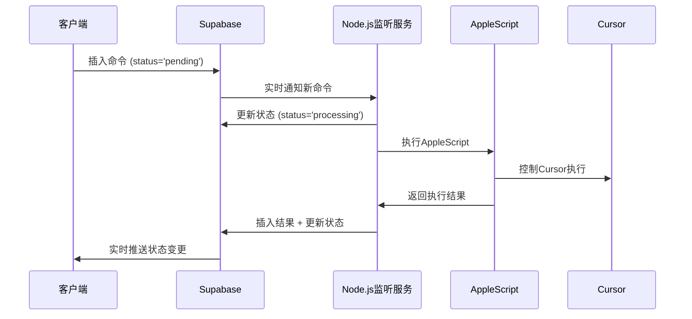

# Cursor远程控制项目
> 基于 Supabase 的无服务器远程控制解决方案，通过手机远程控制 Cursor 应用。

[](https://github.com/terryso/cursor_remote/stargazers)
[](https://github.com/terryso/cursor_remote/pulls)
[](https://opensource.org/licenses/MIT)
[](https://deepwiki.com/terryso/cursor_remote)

[Read this in English](README.en.md)

## 🏗️ 架构升级说明
**重要变更**: 项目已升级为**完全基于Supabase的无服务器架构**，去除了对Express服务器的依赖，系统更加简洁和稳定。

📖 **完整文档**: 查看 [完整架构文档](docs/COMPLETE_ARCHITECTURE.md) 了解新架构设计。

📚 **文档导航**: 查看 [文档目录](docs/README.md) 了解完整的文档结构。

## 🚨 快速开始
如果您是第一次设置此项目：
1. **数据库配置**: 先按照 [数据库设置指南](docs/deployment/SETUP_DATABASE.md) 配置Supabase数据库
2. **架构了解**: 阅读 [完整架构文档](docs/COMPLETE_ARCHITECTURE.md) 理解系统设计
3. **部署状态**: 查看 [部署状态](docs/deployment/DEPLOYMENT_STATUS.md) 了解当前状态

## Demo 体验
[https://cursor-remote.vercel.app/](https://cursor-remote.vercel.app/)

### 🔍 **新功能：集成 Tavily MCP 搜索服务**
Demo服务器已集成 Tavily MCP 搜索功能，您可以直接测试实时搜索能力！

**测试建议**：
- 尝试询问："2025年全球AI发展的最新趋势和突破"
- 或者："量子计算在金融行业的应用案例和效果分析"
- 或者："ChatGPT-5的主要技术突破和与前代产品的区别"

系统会自动使用 Tavily 搜索获取最新信息并返回结果。

## 演示视频 🎬
> 远程控制 Cursor 进行UI自动化测试

[](https://youtu.be/3SWj7X-4Gzs)

## ✨ 主要功能

### 🎮 远程控制
- **命令发送**: 通过手机发送文本命令到 Cursor/VS Code
- **智能建议**: 基于历史记录的命令自动补全
- **实时反馈**: 命令执行状态实时显示

### 📊 系统监控
- **连接状态**: 实时显示 Supabase 连接状态
- **系统指标**: CPU、内存使用率监控
- **性能分析**: 响应时间和成功率统计

### 📝 历史管理
- **命令历史**: 查看和管理所有历史命令
- **搜索过滤**: 快速搜索特定的历史命令
- **删除功能**: 清理不需要的历史记录

### 🔧 诊断工具
- **连接测试**: 一键检测 Supabase 连接问题
- **状态仪表盘**: 多标签页显示详细系统信息
- **错误诊断**: 自动检测并提供解决方案

## 🏗️ 新架构特性

### 无服务器设计
- **纯Supabase BaaS**: 无需Express服务器，降低部署复杂度
- **实时数据同步**: 基于PostgreSQL的原生实时订阅
- **自动API生成**: Supabase自动生成REST API和RPC函数
- **行级安全**: 内置的安全策略和权限控制

### 优化的数据流
```
手机客户端 → Supabase云端 → Node.js监听服务 → AppleScript → Cursor
```

## 一键部署到 Vercel (客户端)

[](https://vercel.com/new/clone?repository-url=https%3A%2F%2Fgithub.com%2Fterryso%2Fcursor_remote&env=SUPABASE_URL,SUPABASE_ANON_KEY&envDescription=SUPABASE_URL%20is%20your%20Supabase%20project%20URL.%20SUPABASE_ANON_KEY%20is%20your%20Supabase%20project%20anon%20key.&project-name=cursor-remote-client&repository-name=cursor-remote-client)

点击上面的按钮将 **客户端** 项目部署到 Vercel。您需要为客户端提供以下环境变量：

- `SUPABASE_URL`: 您的 Supabase 项目 URL
- `SUPABASE_ANON_KEY`: 您的 Supabase 项目公开匿名密钥

## 项目结构

```plaintext
CursorRemote/
├── client/                     # 前端应用（纯JavaScript）
│   ├── index.html              # 主界面
│   ├── app.js                  # 核心应用逻辑
│   ├── enhancement.js          # 增强功能模块
│   ├── systemMonitor.js        # 系统监控
│   └── styles.css              # 样式文件
├── server/                     # 轻量级监听服务
│   ├── src/services/
│   │   └── supabaseService.js  # Supabase监听服务
│   ├── auto-restart.js         # 自动重启机制
│   └── connection-monitor.js   # 连接监控
├── database/                   # 数据库配置
│   ├── tables.sql              # 表结构定义
│   └── functions.sql           # RPC函数定义
├── docs/                       # 完整项目文档
│   ├── COMPLETE_ARCHITECTURE.md  # 主架构文档
│   ├── ROADMAP_2025.md          # 功能路线图
│   └── auto-restart-guide.md    # 部署指南
└── scripts/                    # AppleScript集成
```

### 关键变更说明
- **无Express依赖**: 客户端直接调用Supabase API和RPC函数
- **轻量级服务**: Node.js仅作为监听服务，无HTTP服务器
- **数据库驱动**: 所有业务逻辑通过Supabase函数实现
- **简化部署**: 前端静态部署，后端轻量级本地服务

## 重要前提条件

- **操作系统**: 此解决方案仅在 **macOS** 上经过测试和支持
- **目标应用程序**: 您的 Mac 上必须已安装 **Cursor** 或 **Visual Studio Code**
- **运行状态**: AppleScript 需要目标编辑器处于运行状态
- **快捷键配置**: 确保以下快捷键可用：
    - Agent 模式 (Cursor): `⌘+I`
    - Chat 模式 (Cursor): `⌘+K` 或 `⌘+⇧+K`
    - VS Code: 需要配置 GitHub Copilot Chat 快捷键

## Supabase 数据库配置

⚠️ **重要提示**: 请按照 [数据库设置指南](docs/deployment/SETUP_DATABASE.md) 完成Supabase数据库的详细配置，包括：
- 创建必要的数据表 (`commands`, `results`, `user_favorites`, `command_templates`)
- 配置RPC函数 (分析、历史、模板管理等)
- 设置Realtime订阅
- 配置RLS (Row Level Security) 策略

### 新增数据表
```sql
-- 用户收藏命令
CREATE TABLE user_favorites (
    id UUID DEFAULT gen_random_uuid() PRIMARY KEY,
    command_text TEXT NOT NULL,
    category VARCHAR(50),
    description TEXT,
    usage_count INTEGER DEFAULT 0
);

-- 命令模板
CREATE TABLE command_templates (
    id UUID DEFAULT gen_random_uuid() PRIMARY KEY,
    name VARCHAR(100) NOT NULL,
    template_text TEXT NOT NULL,
    category VARCHAR(50),
    variables JSONB,
    usage_count INTEGER DEFAULT 0
);
```

## Cursor MCP 配置 (用于结果返回)

为了让 Cursor 能够将执行的命令结果写回到您的 Supabase 项目，需要在 Cursor 的 MCP 设置中添加以下配置：

```json
{
  "mcpServers": {
    "supabase": {
      "command": "npx",
      "args": [
        "-y",
        "@supabase/mcp-server-supabase@latest",
        "--access-token",
        "your-supabase-access-token"
      ]
    }
  }
}
```

**重要提示**: 
- 将 `"your-supabase-access-token"` 替换为您 Supabase 项目的有效访问令牌
- 此令牌用于 MCP 服务器向您的 Supabase 数据库写入执行结果
- 可在 [Supabase 控制面板](https://supabase.com/dashboard/account/tokens) 生成访问令牌

## 🚀 功能路线图

查看我们的 [2025年功能路线图](docs/ROADMAP_2025.md) 了解项目发展计划：

### 短期目标 (1-3个月)
- 🎨 用户体验优化 (文件上传、快捷命令)
- 🤖 智能AI助手集成 (多AI引擎支持)
- 🎮 深度编辑器集成 (文件系统操作)

### 中期目标 (3-6个月)
- 👥 多用户支持与认证
- 📱 PWA与离线支持
- 🔧 会话管理系统

### 长期目标 (6个月以上)
- 🌐 跨平台编辑器支持 (JetBrains系列)
- 🔌 插件系统架构
- 🏢 企业级功能

## 安装与使用

### 服务器端

1. 进入服务器目录并安装依赖:
    ```bash
    cd server && npm install
    ```

2. 配置环境变量:
    在项目根目录创建 `.env` 文件:
    ```env
    SUPABASE_URL=https://your-project-id.supabase.co
    SUPABASE_SERVICE_KEY=your-supabase-service-role-key
    DEFAULT_EDITOR=Cursor
    ```

3. 启动监听服务:
    ```bash
    # 开发模式（自动重启）
    npm run dev
    
    # 生产模式（带自动重启监控）
    npm run production
    
    # 手动启动
    npm start
    ```

### 客户端

1. **通过 Vercel 部署 (推荐)**:
    - 点击上方的 "Deploy with Vercel" 按钮
    - 配置 `SUPABASE_URL` 和 `SUPABASE_ANON_KEY` 环境变量

2. **本地运行**:
    - 修改 `client/env-config.js` 配置文件
    - 使用静态文件服务器运行: `npx serve client/`

## 工作原理

### 核心架构流程


### 新架构优势
- **减少延迟**: 客户端直接与Supabase交互
- **提高稳定性**: 无单点故障，Supabase提供高可用性
- **简化部署**: 前端静态部署，后端轻量级服务
- **自动扩展**: Supabase自动处理负载和扩展

## 📚 文档和维护

### 核心文档
- [📐 完整架构文档](docs/COMPLETE_ARCHITECTURE.md) - 系统设计蓝图
- [🚀 功能路线图](docs/ROADMAP_2025.md) - 发展规划
- [🔄 自动重启指南](docs/auto-restart-guide.md) - 服务监控

### 专业文档
- [`docs/deployment/`](docs/deployment/) - 部署和设置指南
- [`docs/testing/`](docs/testing/) - 测试策略文档
- [`docs/fixes/`](docs/fixes/) - 问题修复记录

### 维护工具
项目包含完善的监控和维护机制：
- **自动重启**: `npm run production` 启动带监控的服务
- **连接监控**: 实时监控Supabase连接状态
- **故障恢复**: 自动检测和修复卡住的命令
- **性能分析**: 内置的系统指标收集和展示

## License

本项目根据 [MIT License](LICENSE) 授权。

---

*🎯 追求简洁高效的远程控制体验！*
