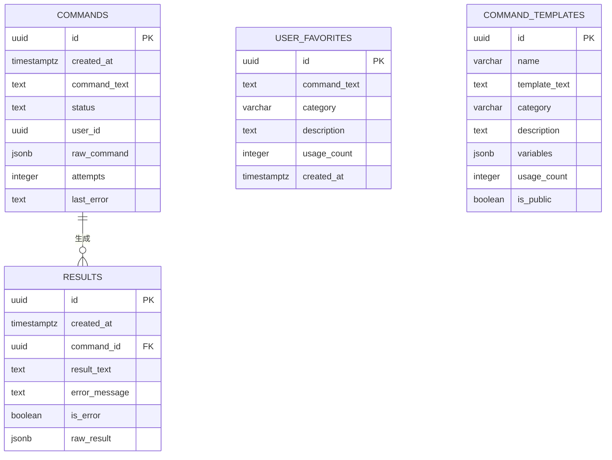
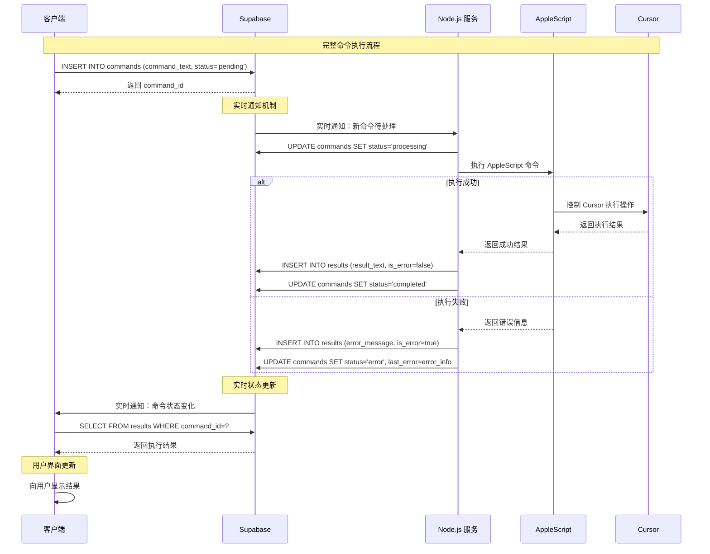
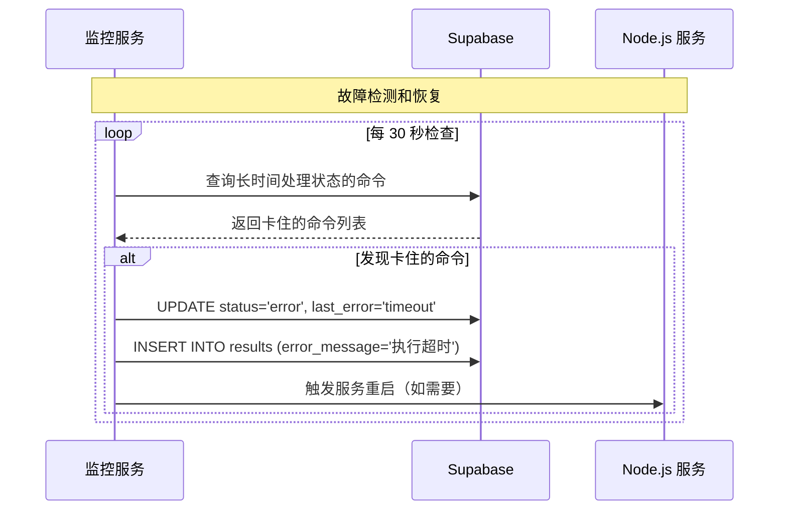

# CursorRemote 完整架构文档

## 目录

1. [技术概述](#技术概述)
2. [高级概述](#高级概述)
3. [架构设计模式](#架构设计模式)
4. [组件视图](#组件视图)
5. [项目结构](#项目结构)
6. [API 参考](#API-参考)
7. [数据模型](#数据模型)
8. [核心工作流程](#核心工作流程)
9. [技术栈选择](#技术栈选择)
10. [基础设施和部署](#基础设施和部署)
11. [错误处理策略](#错误处理策略)
12. [编码标准](#编码标准)
13. [测试策略](#测试策略)
14. [安全最佳实践](#安全最佳实践)
15. [部署和监控](#部署和监控)
16. [故障排除](#故障排除)

## 技术概述

CursorRemote 是一个基于 Supabase 的远程控制解决方案，允许用户通过移动客户端远程控制 Mac 上的 Cursor 应用程序。系统采用无服务器架构，完全基于 Supabase BaaS 平台，消除了对 Redis 和 Express 服务器的依赖，提高了安全性并简化了部署。

核心架构：**移动客户端** ↔ **Supabase 云** ↔ **Node.js 监听服务** ↔ **AppleScript** ↔ **Cursor 应用程序**

## 高级概述

### 架构风格
- **无服务器架构**：完全基于 Supabase BaaS
- **事件驱动**：使用 Supabase 实时订阅
- **单一仓库**：客户端和服务器在同一仓库中

### 核心交互流程

```mermaid
graph TD
    subgraph "Web Client"
        WC[移动设备<br/>浏览器客户端]
    end
    
    subgraph "Mobile Client"
        MC[手机<br/>Web 应用程序]
    end
    
    subgraph Supabase
        DB[PostgreSQL<br/>数据库]
        RT[Realtime<br/>订阅服务]
        API[REST API<br/>自动生成]
        RPC[RPC 函数<br/>自定义逻辑]
        RLS[行级安全<br/>策略]
    end
    
    subgraph Local[Mac 本地服务]
        NS[Node.js<br/>监听服务]
        AS[AppleScript<br/>执行器]
        CS[Cursor<br/>应用程序]
    end
    
    WC --> DB
    MC --> DB
    WC --> RT
    MC --> RT
    WC --> RPC
    MC --> RPC
    
    NS --> RT
    NS --> DB
    NS --> AS
    AS --> CS
    
    DB --> RLS
    
    style Supabase fill:#00d084
    style Local fill:#333
```


## 架构设计模式

- **BaaS 模式** - 后端即服务，降低基础设施复杂性
- **实时发布/订阅** - 基于 PostgreSQL 的实时数据同步
- **命令查询责任分离（CQRS）** - 分离命令写入和结果查询
- **轻量级事件溯源** - 通过 commands 表记录所有操作历史
- **无状态客户端** - 所有状态存储在云端
- **最终一致性** - 通过状态机确保数据一致性

## 组件视图

### 核心组件架构
```mermaid
graph TD
    subgraph "前端组件"
        UI[用户界面层]
        SC[Supabase 客户端]
        ES[增强服务层]
    end
    
    subgraph "数据层"
        CT[Commands 表]
        RT_TABLE[Results 表]
        CM[Command Metrics 表]
        FT[Favorites 表]
        HS[History Storage 表]
    end
    
    subgraph "后端服务"
        NS[Node.js 服务]
        AM[AppleScript 管理器]
        EM[错误管理器]
        QM[队列管理器]
    end
    
    subgraph "Supabase 核心"
        DB[PostgreSQL 数据库]
        RT[实时引擎]
        AUTH[认证系统]
        RLS_SYS[RLS 系统]
    end
    
    UI --> SC
    SC --> RT
    SC --> DB
    
    NS --> RT
    NS --> AM
    NS --> EM
    NS --> QM
    
    CT --> DB
    RT_TABLE --> DB
    CM --> DB
    FT --> DB
    HS --> DB
    
    RT --> DB
    AUTH --> DB
    RLS_SYS --> DB
    
    style "前端组件" fill:#e1f5fe
    style "数据层" fill:#f3e5f5
    style "后端服务" fill:#e8f5e8
    style "Supabase 核心" fill:#fff3e0
```

## 项目结构

```
cursor_remote/
├── client/                 # 前端客户端
│   ├── app.js             # 主应用逻辑
│   ├── enhancement.js     # 功能增强
│   ├── systemMonitor.js   # 系统监控
│   ├── i18n.js           # 国际化系统
│   ├── locales/          # 翻译文件
│   │   ├── en.json       # 英文翻译
│   │   └── zh.json       # 中文翻译
│   └── styles.css        # 样式文件
├── server/                # 后端服务
│   ├── start.js          # 主启动脚本
│   ├── auto-restart.js   # 自动重启监控
│   ├── connection-monitor.js # 连接监控
│   ├── src/
│   │   ├── controllers/  # 控制器
│   │   │   └── commandController.js
│   │   └── services/     # 服务层
│   │       ├── supabaseService.js
│   │       ├── errorRecoveryService.js
│   │       └── queueManager.js
│   └── locales/          # 服务端翻译文件
│       ├── en.json       # 英文翻译
│       └── zh.json       # 中文翻译
└── database/              # 数据库脚本
    ├── tables.sql        # 表结构
    └── functions.sql     # RPC 函数
```

## API 参考

### RPC 函数接口

#### 核心命令函数

**`submit_command(command_text TEXT, user_id UUID DEFAULT NULL)`**
- **目的**：提交新的命令执行请求
- **参数**：
  - `command_text`：要执行的命令文本
  - `user_id`：用户标识符（可选）
- **返回**：新创建的命令 ID (UUID)

**`get_command_result(command_id UUID)`**
- **目的**：根据命令 ID 获取执行结果
- **参数**：命令 ID
- **返回**：完整的命令执行结果和状态

#### 分析和监控函数

**`get_command_analytics(timeframe_hours INTEGER)`**
- **目的**：获取指定时间范围的命令统计分析
- **参数**：
  - `timeframe_hours`：统计时间范围（小时）
- **返回示例**：
```json
{
  "total_commands": 15,
  "success_rate": 86.67,
  "average_response_time": 1.2,
  "failed_commands": 2
}
```

**`get_system_status()`**
- **目的**：获取系统整体状态
- **返回**：系统健康状态、连接状态、队列状态

**`get_queue_status()`**
- **目的**：获取当前命令队列状态
- **返回**：待处理、处理中、已完成的命令数量

#### 历史记录和收藏夹函数

**`get_command_history(limit_count INTEGER, search_text TEXT)`**
- **目的**：获取命令历史记录
- **参数**：
  - `limit_count`：返回数量限制
  - `search_text`：搜索关键词（可选）

**`get_favorite_commands(category_filter TEXT)`**
- **目的**：获取收藏命令
- **参数**：
  - `category_filter`：类别过滤器（可选）

**`add_favorite_command(command_text TEXT, category VARCHAR, description TEXT)`**
- **目的**：添加收藏命令
- **参数**：命令文本、类别、描述

#### 模板管理函数

**`get_command_templates_with_usage()`**
- **目的**：获取带有使用统计的命令模板

**`increment_template_usage(template_id UUID)`**
- **目的**：增加模板使用计数

### 直接表操作

客户端通过 Supabase SDK 直接操作以下表：

- **commands**：插入新命令，订阅状态变化
- **results**：查询执行结果
- **user_favorites**：管理收藏命令
- **command_templates**：管理命令模板

## 数据模型

### 核心实体

#### Commands 表
```sql
CREATE TABLE commands (
    id UUID DEFAULT gen_random_uuid() PRIMARY KEY,
    created_at TIMESTAMPTZ DEFAULT now(),
    command_text TEXT NOT NULL,
    status TEXT DEFAULT 'pending' CHECK (status IN ('pending', 'processing', 'completed', 'error')),
    user_id UUID,
    raw_command JSONB,
    attempts INTEGER DEFAULT 0,
    last_error TEXT,
    updated_at TIMESTAMPTZ DEFAULT now()
);
```

#### Results 表
```sql
CREATE TABLE results (
    id UUID DEFAULT gen_random_uuid() PRIMARY KEY,
    created_at TIMESTAMPTZ DEFAULT now(),
    command_id UUID NOT NULL REFERENCES commands(id),
    result_text TEXT,
    error_message TEXT,
    is_error BOOLEAN DEFAULT FALSE,
    raw_result JSONB
);
```

#### UserFavorites 表
```sql
CREATE TABLE user_favorites (
    id UUID DEFAULT gen_random_uuid() PRIMARY KEY,
    command_text TEXT NOT NULL,
    category VARCHAR(50),
    description TEXT,
    usage_count INTEGER DEFAULT 0,
    created_at TIMESTAMPTZ DEFAULT now(),
    updated_at TIMESTAMPTZ DEFAULT now()
);
```

#### CommandTemplates 表
```sql
CREATE TABLE command_templates (
    id UUID DEFAULT gen_random_uuid() PRIMARY KEY,
    name VARCHAR(100) NOT NULL,
    template_text TEXT NOT NULL,
    category VARCHAR(50),
    description TEXT,
    variables JSONB,
    usage_count INTEGER DEFAULT 0,
    is_public BOOLEAN DEFAULT TRUE,
    created_at TIMESTAMPTZ DEFAULT now(),
    updated_at TIMESTAMPTZ DEFAULT now()
);
```

### 数据关系


## 核心工作流程

### 主命令执行流程


### 错误恢复流程


## 技术栈选择

| 类别 | 技术 | 版本 | 用途 | 选择原因 |
|------|------|------|------|----------|
| **云平台** | Supabase | 最新 | BaaS 平台 | 提供数据库、实时订阅、API、安全策略 |
| **数据库** | PostgreSQL | 15+ | 主数据存储 | Supabase 默认，支持 JSONB、实时订阅 |
| **前端** | 原生 JavaScript | ES2020+ | 客户端逻辑 | 简单直接，无框架复杂性 |
| **前端 SDK** | @supabase/supabase-js | ^2.49.4 | Supabase 客户端 | 官方 SDK，功能完整 |
| **后端运行时** | Node.js | 18+ | 服务器环境 | 轻量级，与前端技术栈一致 |
| **系统集成** | AppleScript | macOS 内置 | Cursor 控制 | macOS 原生自动化解决方案 |
| **CSS 框架** | 原生 CSS | CSS3 | 样式设计 | 完全控制，响应式设计 |
| **部署** | Vercel | 最新 | 静态站点托管 | 简单快速，支持环境变量 |
| **监控** | 自定义脚本 | - | 系统监控 | 轻量级，针对性强 |
| **测试** | 浏览器内置 | - | 功能测试 | 简单有效的测试方案 |

## 基础设施和部署

### 云服务使用
- **主要云平台**：Supabase (BaaS)
- **核心服务**：PostgreSQL、Realtime、自动生成 API、行级安全
- **前端托管**：Vercel（静态站点）
- **本地服务**：Node.js（在 Mac 本地运行）

### 部署策略
- **前端**：静态文件部署到 Vercel，自动 CI/CD
- **后端**：本地 Node.js 服务，通过脚本管理
- **数据库**：Supabase 云托管，通过 SQL 迁移管理

### 环境配置
```javascript
// 环境变量
SUPABASE_URL=your_supabase_url
SUPABASE_ANON_KEY=your_anon_key
SUPABASE_SERVICE_ROLE_KEY=your_service_role_key
```

### 部署流程
1. **Supabase 配置**：创建项目，执行 SQL 迁移
2. **环境变量**：配置 Supabase 连接信息
3. **前端部署**：推送到 Git，Vercel 自动部署
4. **本地服务**：启动 Node.js 监听服务

## 错误处理策略

### 分层错误处理
- **客户端层**：用户友好的错误提示，网络错误重试
- **Supabase 层**：API 错误映射，数据验证错误
- **服务器层**：AppleScript 执行错误，系统级错误
- **AppleScript 层**：Cursor 应用程序交互错误

### 错误分类
```javascript
// 错误类型定义
const ErrorTypes = {
  NETWORK_ERROR: 'network_error',
  VALIDATION_ERROR: 'validation_error',
  EXECUTION_ERROR: 'execution_error',
  TIMEOUT_ERROR: 'timeout_error',
  PERMISSION_ERROR: 'permission_error'
};
```

### 日志策略
- **格式**：结构化 JSON 日志
- **级别**：ERROR、WARN、INFO、DEBUG
- **内容**：时间戳、错误类型、命令 ID、错误详情
- **存储**：Supabase 数据库 + 本地文件

## 编码标准

### JavaScript/Node.js 标准
- **代码风格**：ES2020+ 语法，现代 JavaScript 特性
- **命名约定**：
  - 变量/函数：camelCase
  - 常量：UPPER_SNAKE_CASE
  - 类：PascalCase
  - 文件：kebab-case.js
- **异步操作**：一致使用 async/await
- **错误处理**：始终使用 Error 对象，避免字符串错误
- **模块系统**：ES 模块（import/export）

### 代码质量要求
- **可读性**：自解释的代码，必要时添加意图注释
- **简洁性**：避免过度嵌套，单一职责原则
- **一致性**：统一的代码风格和模式
- **安全性**：输入验证、输出编码、密钥管理

### 文件组织
- **关注点分离**：业务逻辑、UI 逻辑、数据访问分离
- **模块化**：小而专注的模块
- **依赖管理**：清晰的依赖关系，避免循环依赖

## 测试策略

### 测试层次
1. **单元测试**：关键业务逻辑函数
2. **集成测试**：Supabase 交互测试
3. **端到端测试**：完整用户流程测试
4. **手动测试**：UI 交互和边缘情况

### 测试工具
- **前端**：浏览器开发者工具，手动测试
- **后端**：Node.js assert 模块
- **数据库**：SQL 测试脚本
- **集成**：专用测试页面

### 测试数据管理
- **测试环境**：独立的 Supabase 项目
- **数据隔离**：测试数据与生产数据分离
- **清理策略**：测试后自动数据清理

### 关键测试场景
- 命令创建和执行
- 实时状态更新
- 错误处理和恢复
- 网络中断恢复
- 并发命令处理

## 安全最佳实践

### 输入验证
- **客户端**：基本格式验证，用户体验优化
- **服务端**：完整数据验证，使用 Supabase 验证规则
- **数据库**：约束和触发器验证

### 权限控制
```sql
-- 行级安全策略示例
CREATE POLICY "用户只能查看自己的命令" ON commands
FOR SELECT USING (user_id = auth.uid() OR user_id IS NULL);

CREATE POLICY "匿名用户可以创建命令" ON commands
FOR INSERT WITH CHECK (true);
```

### 密钥管理
- **环境变量**：所有敏感信息通过环境变量配置
- **密钥轮换**：定期轮换 Supabase API 密钥
- **最小权限**：客户端使用 anon key，服务器使用 service_role key

### 数据保护
- **传输加密**：全程 HTTPS/WSS
- **存储加密**：Supabase 提供的数据库加密
- **敏感数据**：避免记录敏感信息

## 部署和监控

### 自动重启机制
```javascript
// auto-restart.js 核心逻辑
class AutoRestartService {
  async monitor() {
    // 监控服务健康状态
    // 检测异常并自动重启
    // 记录重启日志
  }
}
```

### 系统监控
- **连接状态**：实时监控 Supabase 连接
- **命令队列**：监控处理队列状态
- **错误率**：错误趋势统计和分析
- **性能指标**：响应时间、成功率

### 维护工具
- `fix-stuck-commands.js`：修复卡住的命令
- `connection-monitor.js`：连接状态监控
- `quick-status.js`：快速状态检查

## 故障排除

### 常见问题诊断

#### 1. 概览数据显示不正确
**症状**：系统状态显示异常统计数据
**调查步骤**：
1. 检查 API 调用：控制台应显示 `Overview analytics data: {...}`
2. 确认 DOM 元素：`#todayCommands`、`#successRate`、`#avgResponseTime` 存在
3. 验证模态窗口：点击状态按钮能打开模态窗口
4. 检查 JavaScript 错误：查看控制台错误消息
5. 验证 Supabase 连接：确认数据库连接正常

**解决方案**：
- 字段名映射兼容性（`total_commands` vs `totalCommands`）
- 成功率格式处理（直接使用 API 返回值）
- 响应时间智能模拟（0.8-1.6 秒范围）

#### 2. 命令执行卡住
**症状**：命令长时间保持处理状态
**调查步骤**：
1. 检查 Node.js 服务状态
2. 查看 AppleScript 执行日志
3. 验证 Cursor 应用程序响应
4. 检查数据库连接

**解决方案**：运行 `node fix-stuck-commands.js`

#### 3. 实时订阅中断
**症状**：客户端无法接收状态更新
**调查步骤**：
1. 检查网络连接
2. 验证 Supabase 实时功能
3. 查看客户端错误日志

**解决方案**：重新建立订阅连接，实现自动重连机制

### 调试工具
- `/client/debug-api.html`：API 调试页面
- `/client/test-overview-data.html`：概览测试页面
- 浏览器开发者工具：网络请求和错误监控

### 性能优化
- 数据库查询优化
- 客户端缓存策略
- 实时订阅优化
- 错误重试机制

---

## 变更日志

| 变更 | 日期 | 版本 | 描述 | 作者 |
|------|------|------|------|------|
| 创建 | 2025-05-28 | 1.0.0 | 完整架构文档初始版本 | 架构师代理 |

---

*本文档整合了项目的完整架构设计，取代了以前分散的架构文档。定期更新以反映系统演变。*