# CursorRemote 完整架构文档

## 目录

1. [技术概述](#技术概述)
2. [高级概述](#高级概述)
3. [架构设计模式](#架构设计模式)
4. [组件视图](#组件视图)
5. [项目结构](#项目结构)
6. [API 参考](#API-参考)
7. [数据模型](#数据模型)
8. [核心工作流程](#核心工作流程)
9. [技术栈选择](#技术栈选择)
10. [基础设施和部署](#基础设施和部署)
11. [错误处理策略](#错误处理策略)
12. [编码标准](#编码标准)
13. [测试策略](#测试策略)
14. [安全最佳实践](#安全最佳实践)
15. [部署和监控](#部署和监控)
16. [故障排除](#故障排除)

## 技术概述

CursorRemote 是一个基于 Supabase 的远程控制解决方案，允许用户通过移动客户端远程控制 Mac 上的 Cursor 应用程序。系统采用无服务器架构，完全基于 Supabase BaaS 平台，消除了对 Redis 和 Express 服务器的依赖，提高了安全性并简化了部署。

核心架构：**移动客户端** ↔ **Supabase 云** ↔ **Node.js 监听服务** ↔ **AppleScript** ↔ **Cursor 应用程序**

## 高级概述

### 架构风格
- **无服务器架构**：完全基于 Supabase BaaS
- **事件驱动**：使用 Supabase 实时订阅
- **单一仓库**：客户端和服务器在同一仓库中

### 核心交互流程

```mermaid
graph TD
    subgraph "Web Client"
        WC[移动设备<br/>浏览器客户端]
    end
    
    subgraph "Mobile Client"
        MC[手机<br/>Web 应用程序]
    end
    
    subgraph Supabase
        DB[PostgreSQL<br/>数据库]
        RT[Realtime<br/>订阅服务]
        API[REST API<br/>自动生成]
        RPC[RPC 函数<br/>自定义逻辑]
        RLS[行级安全<br/>策略]
    end
    
    subgraph Local[Mac 本地服务]
        NS[Node.js<br/>监听服务]
        AS[AppleScript<br/>执行器]
        CS[Cursor<br/>应用程序]
    end
    
    WC --> DB
    MC --> DB
    WC --> RT
    MC --> RT
    WC --> RPC
    MC --> RPC
    
    NS --> RT
    NS --> DB
    NS --> AS
    AS --> CS
    
    DB --> RLS
    
    style Supabase fill:#00d084
    style Local fill:#333
```


## 架构设计模式

- **BaaS 模式** - 后端即服务，降低基础设施复杂性
- **实时发布/订阅** - 基于 PostgreSQL 的实时数据同步
- **命令查询责任分离（CQRS）** - 分离命令写入和结果查询
- **轻量级事件溯源** - 通过 commands 表记录所有操作历史
- **无状态客户端** - 所有状态存储在云端
- **最终一致性** - 通过状态机确保数据一致性

## 组件视图

### 核心组件架构
```mermaid
graph TD
    subgraph "前端组件"
        UI[用户界面层]
        SC[Supabase 客户端]
        ES[增强服务层]
    end
    
    subgraph "数据层"
        CT[Commands 表]
        RT_TABLE[Results 表]
        CM[Command Metrics 表]
        FT[Favorites 表]
        HS[History Storage 表]
    end
    
    subgraph "后端服务"
        NS[Node.js 服务]
        AM[AppleScript 管理器]
        EM[错误管理器]
        QM[队列管理器]
    end
    
    subgraph "Supabase 核心"
        DB[PostgreSQL 数据库]
        RT[实时引擎]
        AUTH[认证系统]
        RLS_SYS[RLS 系统]
    end
    
    UI --> SC
    SC --> RT
    SC --> DB
    
    NS --> RT
    NS --> AM
    NS --> EM
    NS --> QM
    
    CT --> DB
    RT_TABLE --> DB
    CM --> DB
    FT --> DB
    HS --> DB
    
    RT --> DB
    AUTH --> DB
    RLS_SYS --> DB
    
    style "前端组件" fill:#e1f5fe
    style "数据层" fill:#f3e5f5
    style "后端服务" fill:#e8f5e8
    style "Supabase 核心" fill:#fff3e0
```