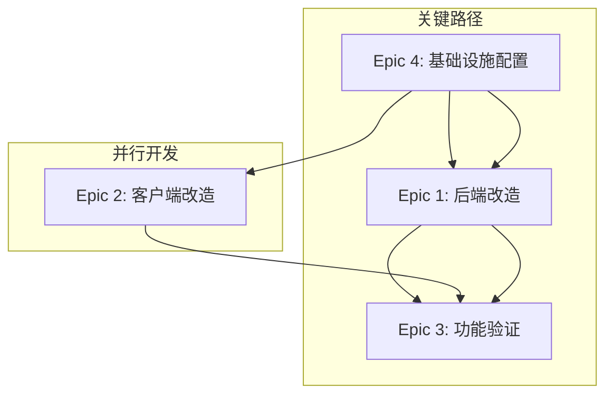

# 史诗技术分解文档

## 📋 文档信息
- **版本**: v2.0
- **来源**: 基于用户故事和技术实施经验
- **更新日期**: 2024年12月
- **目标读者**: 技术团队、架构师、开发者

---

## 🎯 Epic实施总览

### 史诗依赖关系图



### 实施时间轴
1. **第1阶段**: Epic 4 - 基础设施搭建 (1-2天)
2. **第2阶段**: Epic 1 & Epic 2 - 并行开发 (3-5天)
3. **第3阶段**: Epic 3 - 集成测试 (2-3天)

---

## 🔧 Epic 4: Supabase基础设施配置与安全设置

### 实施优先级: 🔴 最高 (阻塞其他Epic)

### 技术实施细节

#### 4.1 Supabase项目创建与配置
**实施复杂度**: ⭐⭐  
**预估时间**: 30分钟

```bash
# 项目配置检查清单
✅ 项目名称: cursor-remote-supabase
✅ 区域选择: 最近地理位置
✅ 数据库密码: 强密码设置
✅ API密钥获取: anon key + service_role key
```

#### 4.2 数据库表结构创建
**实施复杂度**: ⭐⭐⭐  
**预估时间**: 1小时

```sql
-- Commands表创建脚本
CREATE TABLE public.commands (
    id uuid DEFAULT gen_random_uuid() NOT NULL,
    created_at timestamp with time zone DEFAULT now() NOT NULL,
    command_text text NOT NULL,
    status text DEFAULT 'pending'::text NOT NULL,
    user_id uuid,
    raw_command jsonb,
    attempts integer DEFAULT 0,
    last_error text,
    CONSTRAINT commands_pkey PRIMARY KEY (id),
    CONSTRAINT commands_status_check CHECK ((status = ANY (ARRAY['pending'::text, 'processing'::text, 'completed'::text, 'error'::text])))
);

-- Results表创建脚本
CREATE TABLE public.results (
    id uuid DEFAULT gen_random_uuid() NOT NULL,
    created_at timestamp with time zone DEFAULT now() NOT NULL,
    command_id uuid NOT NULL,
    result_text text,
    error_message text,
    is_error boolean DEFAULT false NOT NULL,
    raw_result jsonb,
    CONSTRAINT results_pkey PRIMARY KEY (id),
    CONSTRAINT results_command_id_fkey FOREIGN KEY (command_id) REFERENCES public.commands(id) ON DELETE CASCADE
);

-- 索引创建
CREATE INDEX idx_commands_status ON public.commands(status);
CREATE INDEX idx_commands_created_at ON public.commands(created_at);
CREATE INDEX idx_results_command_id ON public.results(command_id);
```

#### 4.3 行级安全(RLS)策略配置
**实施复杂度**: ⭐⭐⭐⭐  
**预估时间**: 2小时

```sql
-- 启用RLS
ALTER TABLE public.commands ENABLE ROW LEVEL SECURITY;
ALTER TABLE public.results ENABLE ROW LEVEL SECURITY;

-- Commands表策略
-- 1. 允许anon角色插入新记录
CREATE POLICY "anon_can_insert_commands" ON public.commands
    FOR INSERT TO anon
    WITH CHECK (true);

-- 2. 允许anon角色读取所有记录 (初期宽松策略)
CREATE POLICY "anon_can_select_commands" ON public.commands
    FOR SELECT TO anon
    USING (true);

-- 3. 允许service_role更新任何记录
CREATE POLICY "service_role_can_update_commands" ON public.commands
    FOR UPDATE TO service_role
    USING (true);

-- Results表策略
-- 1. 允许service_role插入结果
CREATE POLICY "service_role_can_insert_results" ON public.results
    FOR INSERT TO service_role
    WITH CHECK (true);

-- 2. 允许anon角色读取结果
CREATE POLICY "anon_can_select_results" ON public.results
    FOR SELECT TO anon
    USING (true);
```

#### 4.4 实时功能启用
**实施复杂度**: ⭐⭐  
**预估时间**: 30分钟

```sql
-- 为表启用实时功能
ALTER PUBLICATION supabase_realtime ADD TABLE public.commands;
ALTER PUBLICATION supabase_realtime ADD TABLE public.results;
```

### 关键风险和缓解措施
- **风险**: RLS策略配置错误导致权限问题
- **缓解**: 分步测试每个策略，保留宽松备用策略

---

## 🖥️ Epic 1: 后端核心改造与Supabase集成

### 实施优先级: 🟠 高 (依赖Epic 4)

### 技术架构变更

#### 原有架构
```javascript
// Redis实现
const redis = require('redis');
const subscriber = redis.createClient();
subscriber.subscribe('commands');
```

#### 新架构
```javascript
// Supabase实现
const { createClient } = require('@supabase/supabase-js');
const supabase = createClient(url, serviceKey);
```

### 详细实施计划

#### 1.1 Supabase客户端初始化
**实施复杂度**: ⭐⭐  
**预估时间**: 1小时

```javascript
// server/src/services/supabaseService.js
const { createClient } = require('@supabase/supabase-js');

class SupabaseService {
    constructor() {
        this.supabase = createClient(
            process.env.SUPABASE_URL,
            process.env.SUPABASE_SERVICE_ROLE_KEY,
            {
                auth: {
                    autoRefreshToken: false,
                    persistSession: false
                },
                realtime: {
                    params: {
                        eventsPerSecond: 10
                    }
                }
            }
        );
        this.commandSubscription = null;
    }

    async initialize() {
        try {
            // 测试连接
            const { data, error } = await this.supabase
                .from('commands')
                .select('count')
                .limit(1);
            
            if (error) throw error;
            console.log('✅ Supabase connection established');
            return true;
        } catch (error) {
            console.error('❌ Supabase connection failed:', error);
            return false;
        }
    }
}
```

#### 1.2 实时订阅实现
**实施复杂度**: ⭐⭐⭐⭐  
**预估时间**: 3小时

```javascript
// 复杂的实时订阅逻辑
async setupCommandSubscription() {
    this.commandSubscription = this.supabase
        .channel('public:commands')
        .on(
            'postgres_changes',
            {
                event: 'INSERT',
                schema: 'public',
                table: 'commands',
                filter: 'status=eq.pending'
            },
            this.handleNewCommand.bind(this)
        )
        .on('subscribe', (status) => {
            console.log('📡 Commands subscription status:', status);
        })
        .on('error', (error) => {
            console.error('❌ Subscription error:', error);
            this.reconnectSubscription();
        })
        .subscribe();
}

async handleNewCommand(payload) {
    const command = payload.new;
    console.log(`🎯 Processing new command: ${command.id}`);
    
    try {
        // 更新状态为processing
        await this.updateCommandStatus(command.id, 'processing');
        
        // 执行AppleScript
        const result = await this.executeAppleScript(command.command_text);
        
        // 存储结果
        await this.storeResult(command.id, result);
        
        // 更新状态为completed
        await this.updateCommandStatus(command.id, 'completed');
        
    } catch (error) {
        console.error(`❌ Command execution failed:`, error);
        
        // 存储错误结果
        await this.storeResult(command.id, error.message, true);
        
        // 更新状态为error
        await this.updateCommandStatus(command.id, 'error', error.message);
    }
}
```

#### 1.3 错误处理和重连机制
**实施复杂度**: ⭐⭐⭐⭐⭐  
**预估时间**: 4小时

```javascript
// 高级错误处理和重连
class ConnectionManager {
    constructor(supabaseService) {
        this.supabaseService = supabaseService;
        this.retryCount = 0;
        this.maxRetries = 5;
        this.retryDelay = 1000; // 1秒
        this.isConnected = false;
    }

    async ensureConnection() {
        if (!this.isConnected) {
            await this.reconnectWithBackoff();
        }
    }

    async reconnectWithBackoff() {
        for (let i = 0; i < this.maxRetries; i++) {
            try {
                await this.supabaseService.initialize();
                await this.supabaseService.setupCommandSubscription();
                this.isConnected = true;
                this.retryCount = 0;
                console.log('✅ Connection restored');
                return;
            } catch (error) {
                const delay = this.retryDelay * Math.pow(2, i);
                console.log(`🔄 Retry ${i + 1}/${this.maxRetries} in ${delay}ms`);
                await new Promise(resolve => setTimeout(resolve, delay));
            }
        }
        throw new Error('Failed to establish connection after maximum retries');
    }
}
```

### 关键技术决策
1. **订阅机制**: 使用Supabase Realtime而非轮询
2. **错误恢复**: 指数退避重试策略
3. **状态管理**: 严格的状态机转换
4. **并发处理**: 单进程顺序处理，避免竞争条件

---

## 🌐 Epic 2: 客户端核心改造与Supabase集成

### 实施优先级: 🟠 高 (可与Epic 1并行)

### 客户端架构重构

#### 2.1 Supabase客户端集成
**实施复杂度**: ⭐⭐⭐  
**预估时间**: 2小时

```javascript
// client/js/supabaseClient.js
import { createClient } from 'https://esm.sh/@supabase/supabase-js@2';

class CursorRemoteClient {
    constructor() {
        this.supabase = createClient(
            window.SUPABASE_URL,
            window.SUPABASE_ANON_KEY
        );
        this.activeSubscriptions = new Map();
    }

    async sendCommand(commandText) {
        try {
            const { data, error } = await this.supabase
                .from('commands')
                .insert({
                    command_text: commandText,
                    status: 'pending'
                })
                .select()
                .single();

            if (error) throw error;
            
            console.log(`📤 Command sent: ${data.id}`);
            return data.id;
        } catch (error) {
            console.error('❌ Failed to send command:', error);
            throw error;
        }
    }
}
```

#### 2.2 实时状态监听
**实施复杂度**: ⭐⭐⭐⭐  
**预估时间**: 3小时

```javascript
// 复杂的订阅管理
async subscribeToCommand(commandId) {
    const subscriptionKey = `command_${commandId}`;
    
    // 防止重复订阅
    if (this.activeSubscriptions.has(subscriptionKey)) {
        return;
    }

    const subscription = this.supabase
        .channel(`command_${commandId}`)
        .on(
            'postgres_changes',
            {
                event: 'UPDATE',
                schema: 'public',
                table: 'commands',
                filter: `id=eq.${commandId}`
            },
            async (payload) => {
                const command = payload.new;
                console.log(`📊 Command status update: ${command.status}`);
                
                if (command.status === 'completed' || command.status === 'error') {
                    await this.handleCommandComplete(commandId, command.status);
                    this.unsubscribeFromCommand(commandId);
                }
            }
        )
        .subscribe();

    // 设置超时清理
    const timeoutId = setTimeout(() => {
        this.unsubscribeFromCommand(commandId);
        this.showError('⏰ Command timeout - no response received');
    }, 30000); // 30秒超时

    this.activeSubscriptions.set(subscriptionKey, {
        subscription,
        timeoutId
    });
}

async handleCommandComplete(commandId, status) {
    try {
        const { data: results, error } = await this.supabase
            .from('results')
            .select('*')
            .eq('command_id', commandId)
            .order('created_at', { ascending: false })
            .limit(1);

        if (error) throw error;

        if (results && results.length > 0) {
            const result = results[0];
            if (result.is_error) {
                this.showError(result.error_message);
            } else {
                this.showResult(result.result_text);
            }
        }
    } catch (error) {
        console.error('❌ Failed to fetch result:', error);
        this.showError('Failed to fetch command result');
    }
}
```

#### 2.3 连接状态管理
**实施复杂度**: ⭐⭐⭐  
**预估时间**: 2小时

```javascript
// 连接状态监控和UI反馈
class ConnectionStatus {
    constructor(client) {
        this.client = client;
        this.isOnline = navigator.onLine;
        this.setupEventListeners();
        this.updateUI();
    }

    setupEventListeners() {
        window.addEventListener('online', () => {
            this.isOnline = true;
            this.updateUI();
            this.retryFailedOperations();
        });

        window.addEventListener('offline', () => {
            this.isOnline = false;
            this.updateUI();
        });

        // Supabase连接状态监听
        this.client.supabase.realtime.onOpen(() => {
            console.log('🔗 Realtime connection opened');
            this.updateConnectionStatus(true);
        });

        this.client.supabase.realtime.onClose(() => {
            console.log('🔗 Realtime connection closed');
            this.updateConnectionStatus(false);
        });
    }

    updateUI() {
        const statusElement = document.getElementById('connectionStatus');
        if (statusElement) {
            statusElement.className = this.isOnline ? 'online' : 'offline';
            statusElement.textContent = this.isOnline ? '🟢 在线' : '🔴 离线';
        }
    }
}
```

### UI/UX改进要点
1. **加载状态**: 清晰的命令发送和处理状态指示
2. **错误处理**: 用户友好的错误消息和重试选项
3. **连接状态**: 实时连接状态显示
4. **响应式设计**: 保持移动端友好的界面

---

## 🧪 Epic 3: 核心功能迁移验证与端到端测试

### 实施优先级: 🟡 中等 (需要Epic 1&2完成)

### 测试策略与实施

#### 3.1 自动化测试套件
**实施复杂度**: ⭐⭐⭐⭐  
**预估时间**: 4小时

```javascript
// tests/e2e/supabase-migration.test.js
describe('Supabase Migration E2E Tests', () => {
    let testClient;
    let testServer;

    beforeAll(async () => {
        testClient = new CursorRemoteClient();
        testServer = new SupabaseService();
        await testServer.initialize();
    });

    test('完整指令流程测试', async () => {
        // 1. 发送测试指令
        const commandId = await testClient.sendCommand('test command');
        expect(commandId).toBeDefined();

        // 2. 验证指令在数据库中
        const { data: command } = await testServer.supabase
            .from('commands')
            .select('*')
            .eq('id', commandId)
            .single();
        
        expect(command.status).toBe('pending');

        // 3. 等待处理完成
        await waitForCommandCompletion(commandId, 10000);

        // 4. 验证结果
        const { data: result } = await testServer.supabase
            .from('results')
            .select('*')
            .eq('command_id', commandId)
            .single();
        
        expect(result).toBeDefined();
        expect(result.result_text || result.error_message).toBeDefined();
    });

    test('错误处理测试', async () => {
        const commandId = await testClient.sendCommand('invalid_command_trigger_error');
        await waitForCommandCompletion(commandId, 10000);

        const { data: command } = await testServer.supabase
            .from('commands')
            .select('*')
            .eq('id', commandId)
            .single();
        
        expect(command.status).toBe('error');
        expect(command.last_error).toBeDefined();
    });
});

async function waitForCommandCompletion(commandId, timeout = 10000) {
    return new Promise((resolve, reject) => {
        const startTime = Date.now();
        
        const checkStatus = async () => {
            const { data: command } = await testServer.supabase
                .from('commands')
                .select('status')
                .eq('id', commandId)
                .single();
            
            if (command.status === 'completed' || command.status === 'error') {
                resolve(command.status);
            } else if (Date.now() - startTime > timeout) {
                reject(new Error('Command timeout'));
            } else {
                setTimeout(checkStatus, 100);
            }
        };
        
        checkStatus();
    });
}
```

#### 3.2 性能基准测试
**实施复杂度**: ⭐⭐⭐  
**预估时间**: 2小时

```javascript
// 性能测试套件
describe('Performance Benchmarks', () => {
    test('命令响应时间基准', async () => {
        const startTime = Date.now();
        
        const commandId = await testClient.sendCommand('benchmark test');
        await waitForCommandCompletion(commandId);
        
        const endTime = Date.now();
        const responseTime = endTime - startTime;
        
        console.log(`📊 Command response time: ${responseTime}ms`);
        
        // 基准: 应该在10秒内完成
        expect(responseTime).toBeLessThan(10000);
    });

    test('并发指令处理', async () => {
        const concurrentCommands = 5;
        const commands = [];

        for (let i = 0; i < concurrentCommands; i++) {
            commands.push(testClient.sendCommand(`concurrent test ${i}`));
        }

        const commandIds = await Promise.all(commands);
        
        // 等待所有命令完成
        await Promise.all(
            commandIds.map(id => waitForCommandCompletion(id))
        );

        // 验证所有命令都成功处理
        for (const commandId of commandIds) {
            const { data: command } = await testServer.supabase
                .from('commands')
                .select('status')
                .eq('id', commandId)
                .single();
            
            expect(['completed', 'error']).toContain(command.status);
        }
    });
});
```

#### 3.3 回归测试检查清单
**实施复杂度**: ⭐⭐  
**预估时间**: 1小时

```markdown
## 功能回归测试清单

### 核心功能测试
- [ ] 聊天模式指令 (chat, agent, ask)
- [ ] 动作指令 (新建聊天, 清除聊天, 保存代码, 运行代码)
- [ ] 错误处理和用户提示
- [ ] 指令历史记录

### 性能测试
- [ ] 单一指令响应时间 < 10秒
- [ ] 并发指令处理能力
- [ ] 长时间运行稳定性
- [ ] 内存使用情况

### 安全性测试
- [ ] RLS策略有效性
- [ ] API密钥安全性
- [ ] 数据访问权限控制
- [ ] 注入攻击防护

### 兼容性测试
- [ ] Safari移动端
- [ ] Chrome移动端
- [ ] Firefox移动端
- [ ] 不同网络条件
```

### 关键测试场景
1. **快乐路径**: 正常指令发送-处理-返回结果
2. **错误路径**: 无效指令、网络中断、服务器错误
3. **边界条件**: 长指令、特殊字符、并发请求
4. **性能基准**: 响应时间、吞吐量、资源使用

---

## 📊 总体实施计划

### 资源分配建议
- **后端开发**: 40% (Epic 1)
- **前端开发**: 30% (Epic 2)  
- **基础设施**: 15% (Epic 4)
- **测试验证**: 15% (Epic 3)

### 风险缓解策略

#### 高风险项目
1. **实时订阅稳定性**
   - 缓解: 详细测试各种网络条件
   - 备案: 实现轮询备用机制

2. **RLS策略复杂性**
   - 缓解: 分阶段实施，先宽松后严格
   - 备案: 文档化所有策略决策

3. **性能回归**
   - 缓解: 建立性能基准和监控
   - 备案: 准备性能优化方案

### 成功标准
- ✅ 所有原有功能正常工作
- ✅ 响应时间满足用户期望
- ✅ 系统稳定性不低于原有水平
- ✅ 安全性得到明显提升
- ✅ 代码质量和可维护性改善

---

## 🔄 后续优化方向

### 短期优化 (1-2周)
- 性能调优和监控完善
- 错误处理机制优化
- 用户体验细节改进

### 中期规划 (1-3个月)
- 用户认证系统集成
- 多用户数据隔离
- 高级分析和监控

### 长期愿景 (3-6个月)
- 移动应用开发
- 云函数集成
- 智能命令建议

---

*技术文档整理: 产品经理Bill与架构团队 | 最后更新: 2024年12月* 