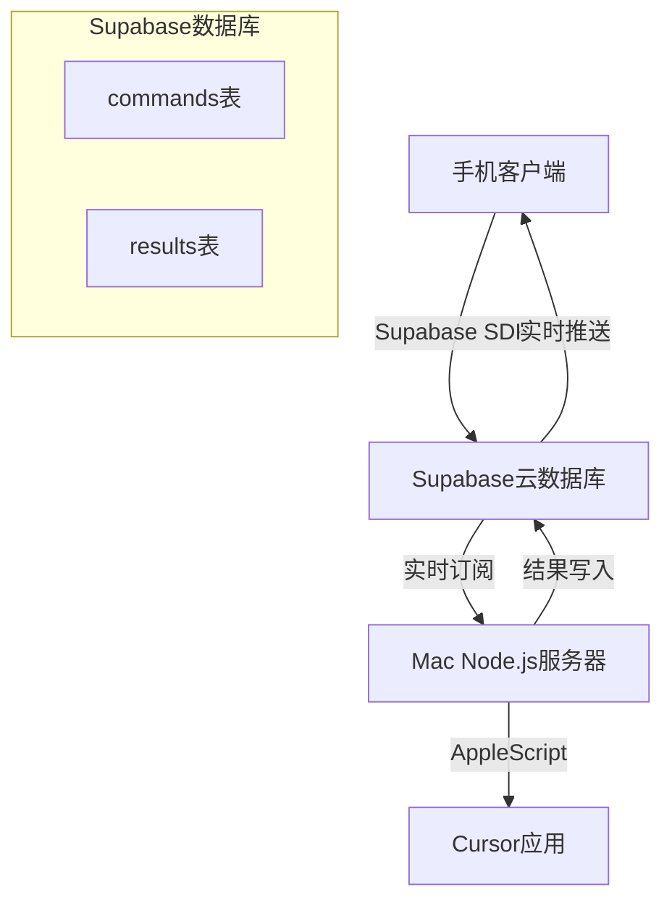

# 产品需求文档 (PRD): Cursor远程控制解决方案 - Supabase迁移

## 📋 文档版本信息
- **版本**: v2.0 (整合版)
- **更新日期**: 2024年12月
- **状态**: 已确认
- **来源**: 整合自.ai/prd.md、.ai/project_brief_supabase_migration.md等

---

## 1. 项目概述

### 1.1 项目背景
当前Cursor远程控制项目通过手机客户端发送指令，经由Redis Pub/Sub传递至Mac上的Node.js服务器，通过AppleScript控制Cursor应用，并将结果通过Redis返回。

### 1.2 核心痛点
- **安全风险**: Redis需要公网访问，带来数据暴露和未授权访问风险
- **配置复杂**: 需要配置端口转发、防火墙规则等复杂网络设置
- **维护困难**: 本地Redis服务的稳定性和监控问题

### 1.3 解决方案目标
采用Supabase替换Redis Pub/Sub通信机制，实现：
- ✅ 提升安全性 - 无需本地服务公网暴露
- ✅ 简化配置 - 利用BaaS平台的现成服务
- ✅ 结构化存储 - PostgreSQL数据库支持复杂查询
- ✅ 未来扩展 - 为用户认证、文件存储等功能奠定基础

### 1.4 项目范围

#### 🎯 范围内
- 使用Supabase实时数据库替换Redis Pub/Sub功能
- 迁移客户端和服务器端通信逻辑到Supabase SDK
- 设计`commands`和`results`数据表支持现有功能
- 配置Supabase行级安全(RLS)策略保护数据
- 确保所有现有核心功能正常工作

#### 🚫 范围外 (本迭代不包括)
- 新增用户功能 (除迁移必需外)
- 客户端UI/UX重大修改
- Supabase其他服务的全面集成 (Auth、Storage等)
- 用户认证功能实现

---

## 2. 用户及使用场景

### 2.1 目标用户
- **主要用户**: 开发者个人使用
- **用户特征**: 熟悉技术工具，需要远程控制IDE的便利性
- **使用环境**: 手机客户端 + Mac桌面端Cursor

### 2.2 核心用户场景 (保持现有功能)

#### 场景1: 远程聊天控制
- 用户通过手机发送自然语言聊天指令给Cursor
- 支持不同聊天模式 (chat, agent, ask)
- 实时接收Cursor的回复结果

#### 场景2: 远程操作控制  
- 用户发送动作指令 (新建聊天、清除聊天、保存代码、运行代码)
- 服务器通过AppleScript执行相应操作
- 返回操作结果或确认信息

#### 场景3: 错误处理
- 当指令执行失败时，用户能收到清晰的错误信息
- 支持重试机制和错误日志记录

---

## 3. 技术解决方案

### 3.1 整体架构变更

### 3.2 数据模型设计

#### 3.2.1 `commands` 表
| 字段名 | 类型 | 描述 | 约束 |
|--------|------|------|------|
| id | UUID | 主键，唯一标识 | PK, 自动生成 |
| created_at | TIMESTAMPTZ | 创建时间戳 | 自动生成, now() |
| command_text | TEXT | 命令内容 (用户输入的自然语言) | NOT NULL |
| status | TEXT | 命令状态 | NOT NULL, 默认'pending' |
| user_id | UUID | 用户标识 (占位符) | 可空，未来用户认证使用 |
| raw_command | JSONB | 结构化的原始命令数据 | 可空 |
| attempts | INTEGER | 重试次数 | 默认0 |
| last_error | TEXT | 最后一次错误信息 | 可空 |

**状态值定义**:
- `pending`: 待处理
- `processing`: 处理中  
- `completed`: 已完成
- `error`: 执行错误

#### 3.2.2 `results` 表
| 字段名 | 类型 | 描述 | 约束 |
|--------|------|------|------|
| id | UUID | 主键，唯一标识 | PK, 自动生成 |
| created_at | TIMESTAMPTZ | 创建时间戳 | 自动生成, now() |
| command_id | UUID | 关联的commands表指令ID | NOT NULL, FK |
| result_text | TEXT | 执行结果内容 | Cursor的直接输出 |
| error_message | TEXT | 错误信息 | 发生错误时使用 |
| is_error | BOOLEAN | 是否为错误结果 | NOT NULL, 默认FALSE |
| raw_result | JSONB | 结构化的原始结果数据 | 可空，用于后续分析 |

### 3.3 安全策略

#### 3.3.1 访问权限设计
- **服务器端 (service_role)**: 
  - 读取commands记录
  - 更新commands状态  
  - 创建results记录
- **客户端 (anon/authenticated)**:
  - 创建commands记录
  - 读取commands和results记录
  - 初期采用相对宽松的RLS策略

#### 3.3.2 数据隔离策略
- **当前版本**: 不实现严格的用户数据隔离
- **user_id字段**: 仅作为未来功能占位符
- **共享模式**: 客户端可能为多用户或匿名用户服务

---

## 4. 详细功能需求

### 4.1 服务器端需求
- **US1.1**: 实时订阅commands表中status='pending'的新指令
- **US1.2**: 接收指令后将status更新为'processing'  
- **US1.3**: 执行完成后将结果存入results表
- **US1.4**: 更新commands表status为'completed'或'error'
- **US1.5**: 创建commands数据表结构
- **US1.6**: 创建results数据表结构  
- **US1.7**: 处理和记录执行错误信息

### 4.2 客户端需求
- **US2.1**: 将用户指令写入commands表
- **US2.2**: 实时订阅commands状态变化
- **US2.3**: 获取并展示results表中的执行结果
- **US2.4**: 清晰展示错误信息给用户

### 4.3 核心功能验证
- **US3.1**: 聊天和动作指令的端到端功能验证
- **US3.2**: 完整流程的正确性和响应速度测试
- **US3.3**: 各种错误场景的处理验证

### 4.4 基础设施配置
- **US4.1**: 创建Supabase项目
- **US4.2**: 创建数据表和关系配置
- **US4.3**: 配置服务器端API密钥
- **US4.4**: 配置客户端匿名密钥
- **US4.5**: 设置初步RLS策略

---

## 5. 非功能性需求

### 5.1 性能要求
- **响应时间**: 满足个人使用的基本体验，无明显卡顿
- **实时性**: 消息传递延迟在可接受范围内
- **量化目标**: 初期不设具体量化指标

### 5.2 可靠性要求
- **错误处理**: 指令和结果不错不漏
- **网络恢复**: 能处理偶发的网络中断
- **重试机制**: 基本的失败重试，初期从简

### 5.3 安全性要求
- **核心目标**: 解决Redis公网暴露问题
- **基础安全**: 正确使用Supabase提供的安全机制
- **数据保护**: 通过RLS策略控制数据访问

### 5.4 可维护性要求
- **代码清晰**: 结构清晰易于理解和修改
- **文档完整**: Supabase配置和RLS策略有文档记录
- **调试支持**: 提供必要的日志和调试信息

### 5.5 可伸缩性要求
- **当前范围**: 为个人使用设计，暂不考虑大规模并发
- **数据保留**: 按Supabase默认策略，后续根据需要调整

---

## 6. 成功标准

### 6.1 功能成功标准
- ✅ 所有现有核心功能在Supabase迁移后正常工作
- ✅ 手机远程控制Cursor的各种操作功能完整
- ✅ 聊天指令和动作指令的完整执行流程
- ✅ 错误信息的正确传递和展示

### 6.2 技术成功标准  
- ✅ Redis公网暴露问题彻底解决
- ✅ 系统安全性相比之前明显提升
- ✅ 开发者能清晰理解和维护新方案
- ✅ Supabase集成方案运行稳定

### 6.3 用户体验标准
- ✅ 响应速度满足个人使用需求
- ✅ 核心交互流程保持不变
- ✅ 错误提示清晰友好
- ✅ 无明显功能退化

---

## 7. 关键假设与限制

### 7.1 技术假设
- Supabase实时数据库能满足当前的性能需求
- PostgreSQL数据库适合存储命令和结果数据
- Supabase SDK在客户端和服务器端都能稳定工作
- AppleScript与Node.js的集成方式保持不变

### 7.2 业务假设
- 用户接受从Redis到Supabase的迁移变化
- 现有的核心用户场景不需要调整
- 个人使用场景下的数据量和并发量在可控范围内
- 不需要立即实现多用户和用户认证功能

### 7.3 项目限制
- 本次迁移专注于通信机制替换，不改变核心业务逻辑
- UI/UX修改限制在最小必要范围内
- 不包含Supabase高级功能的深度集成
- 成功标准以定性评估为主，暂不设量化指标

---

## 8. 风险评估与缓解

### 8.1 技术风险
- **风险**: Supabase性能不满足实时需求
- **缓解**: 在正式迁移前进行原型验证和性能测试

- **风险**: 数据迁移过程中功能中断
- **缓解**: 制定详细的迁移计划和回滚方案

### 8.2 集成风险
- **风险**: Supabase SDK与现有代码集成困难
- **缓解**: 分阶段进行代码重构，保留原有架构作为备份

- **风险**: RLS策略配置错误导致安全问题
- **缓解**: 详细测试安全策略，初期采用保守配置

### 8.3 用户体验风险
- **风险**: 迁移后响应速度下降
- **缓解**: 性能基准测试和优化调整

- **风险**: 现有功能在新架构下不稳定
- **缓解**: 全面的端到端测试验证

---

## 9. 未来路线图

### 9.1 Post-MVP功能 (范围外)
- 基于Supabase Auth的用户认证系统
- 多用户支持和数据隔离
- 结构化command_text和result_text
- 性能和可伸缩性优化
- Supabase Storage集成文件存储
- 高级错误处理和用户反馈机制

### 9.2 技术债务管理
- 优化数据库查询性能
- 改进错误日志和监控
- 代码重构和架构优化
- 安全策略的持续改进

---

## 10. 附录

### 10.1 相关文档
- [完整架构文档](../COMPLETE_ARCHITECTURE.md)
- [用户故事详细列表](USER_STORIES.md)
- [技术实现史诗](EPICS_BREAKDOWN.md)

### 10.2 决策记录
- 选择Supabase而非其他BaaS平台的原因
- 数据模型设计的考虑因素
- RLS策略的安全性权衡

### 10.3 术语表
- **BaaS**: Backend as a Service，后端即服务
- **RLS**: Row Level Security，行级安全
- **AppleScript**: macOS自动化脚本语言
- **Pub/Sub**: 发布/订阅消息模式

---

*最后更新: 2024年12月 - 产品经理Bill整理* 