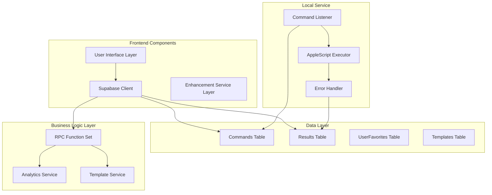
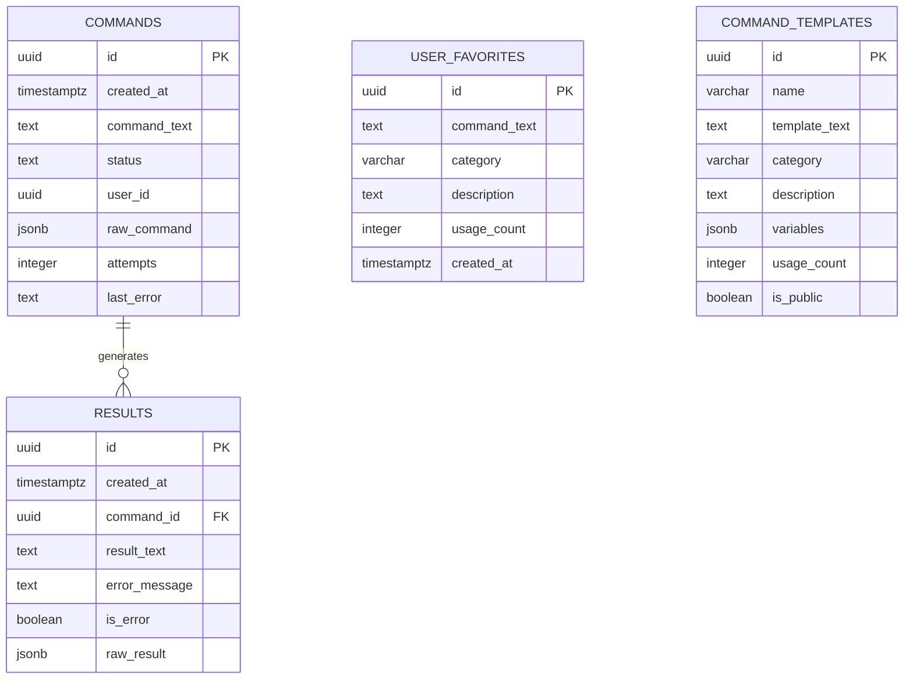
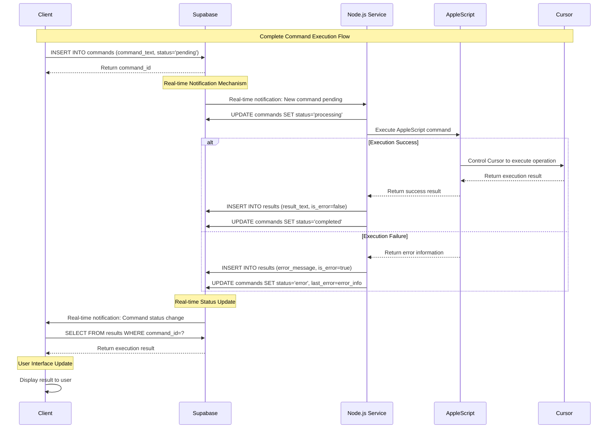
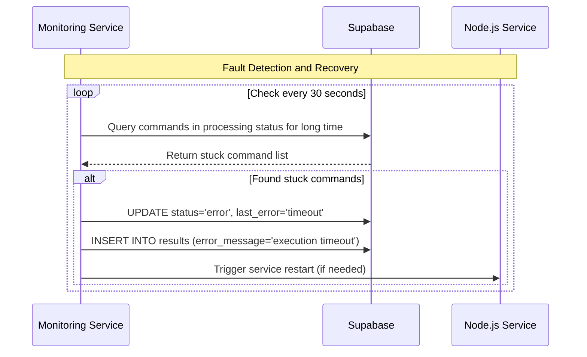

# CursorRemote Complete Architecture Documentation

## Table of Contents

1. [Technical Overview](#technical-overview)
2. [High-Level Overview](#high-level-overview)
3. [Architectural Design Patterns](#architectural-design-patterns)
4. [Component View](#component-view)
5. [Project Structure](#project-structure)
6. [API Reference](#api-reference)
7. [Data Model](#data-model)
8. [Core Workflows](#core-workflows)
9. [Technology Stack Selection](#technology-stack-selection)
10. [Infrastructure and Deployment](#infrastructure-and-deployment)
11. [Error Handling Strategy](#error-handling-strategy)
12. [Coding Standards](#coding-standards)
13. [Testing Strategy](#testing-strategy)
14. [Security Best Practices](#security-best-practices)
15. [Deployment and Monitoring](#deployment-and-monitoring)
16. [Troubleshooting](#troubleshooting)

## Technical Overview

CursorRemote is a Supabase-based remote control solution that allows users to remotely control the Cursor application on Mac through mobile clients. The system adopts a serverless architecture, completely based on the Supabase BaaS platform, eliminating dependencies on Redis and Express servers, improving security and simplifying deployment.

Core Architecture: **Mobile Client** ↔ **Supabase Cloud** ↔ **Node.js Listener Service** ↔ **AppleScript** ↔ **Cursor Application**

## High-Level Overview

### Architecture Style
- **Serverless Architecture**: Completely based on Supabase BaaS
- **Event-Driven**: Using Supabase real-time subscriptions
- **Monorepo**: Client and server in the same repository

### Core Interaction Flow

```mermaid
graph TD
    subgraph "Web Client"
        WC[Mobile Device<br/>Browser Client]
    end
    
    subgraph "Mobile Client"
        MC[Phone<br/>Web Application]
    end
    
    subgraph Supabase
        DB[PostgreSQL<br/>Database]
        RT[Realtime<br/>Subscription Service]
        API[REST API<br/>Auto-generated]
        RPC[RPC Functions<br/>Custom Logic]
        RLS[Row Level Security<br/>Policies]
    end
    
    subgraph Local[Mac Local Service]
        NS[Node.js<br/>Listener Service]
        AS[AppleScript<br/>Executor]
        CS[Cursor<br/>Application]
    end
    
    WC --> DB
    MC --> DB
    WC --> RT
    MC --> RT
    WC --> RPC
    MC --> RPC
    
    NS --> RT
    NS --> DB
    NS --> AS
    AS --> CS
    
    DB --> RLS
    
    style Supabase fill:#00d084
    style Local fill:#333
```


## Architectural Design Patterns

- **BaaS Pattern** - Backend as a Service, reducing infrastructure complexity
- **Real-time Publish/Subscribe** - Real-time data sync based on PostgreSQL
- **Command Query Responsibility Segregation (CQRS)** - Separating command writes and result queries
- **Lightweight Event Sourcing** - Recording all operation history through commands table
- **Stateless Client** - All state stored in the cloud
- **Eventual Consistency** - Ensuring data consistency through state machines

## Component View

### Core Component Architecture


### Component Responsibilities

- **User Interface Layer**: Provides responsive web interface, supports command input, history viewing, status monitoring
- **Supabase Client**: Handles all interactions with Supabase, including real-time subscriptions
- **Enhancement Service Layer**: Provides advanced features like favorites, templates, analytics
- **Node.js Listener**: Listens for new commands and triggers AppleScript execution
- **AppleScript Executor**: Directly interacts with the Cursor application
- **Error Handler**: Uniformly handles and logs error information

## Project Structure

```plaintext
CursorRemote/
├── .ai/                        # AI-generated docs and config
│   ├── prd.md                  # Product Requirements Document
│   └── project_brief_supabase_migration.md
├── bmad-agent/                 # BMad method related config
│   ├── checklists/
│   ├── data/
│   ├── personas/
│   ├── tasks/
│   └── templates/
├── client/                     # Frontend application code
│   ├── index.html              # Main page
│   ├── styles.css              # Style files
│   ├── app.js                  # Main application logic
│   ├── enhancement.js          # Enhancement features
│   ├── systemMonitor.js        # System monitoring
│   ├── env-config.js           # Environment configuration
│   └── tests/                  # Frontend tests
├── server/                     # Backend service code
│   ├── src/
│   │   ├── controllers/        # Controllers (legacy)
│   │   └── services/
│   │       └── supabaseService.js  # Main service file
│   ├── auto-restart.js         # Auto-restart service
│   ├── connection-monitor.js   # Connection monitoring
│   ├── fix-stuck-commands.js   # Fault repair tool
│   ├── package.json            # Dependency configuration
│   └── tests/                  # Backend tests
├── database/                   # Database configuration
│   ├── tables.sql              # Table structure definition
│   └── functions.sql           # RPC function definition
├── docs/                       # Project documentation
│   ├── COMPLETE_ARCHITECTURE.md   # This document
│   ├── architecture/
│   ├── deployment/
│   ├── testing/
│   └── fixes/
├── scripts/                    # Deployment and maintenance scripts
│   └── maintenance/
├── .env.example                # Environment variables example
├── package.json                # Root project configuration
├── vercel.json                 # Vercel deployment configuration
└── README.md                   # Project description
```

### Key Directory Descriptions

- **client/**: Contains all frontend code, implemented with native JavaScript
- **server/**: Node.js service, mainly responsible for listening to Supabase changes and executing AppleScript
- **database/**: Supabase database table structure and function definitions
- **docs/**: Complete project documentation, including architecture, deployment, testing guides

## API Reference

### Supabase RPC Functions

#### Analytics Related Functions

**`get_command_analytics(timeframe_hours INTEGER)`**
- **Purpose**: Get command statistics analysis for the specified time range
- **Parameters**: 
  - `timeframe_hours`: Statistical time range (hours)
- **Return example**:
```json
{
  "total_commands": 15,
  "success_rate": 86.67,
  "average_response_time": 1.2,
  "failed_commands": 2
}
```

**`get_system_status()`**
- **Purpose**: Get overall system status
- **Returns**: System health status, connection status, queue status

**`get_queue_status()`**
- **Purpose**: Get current command queue status
- **Returns**: Number of pending, processing, and completed commands

#### History and Favorites Functions

**`get_command_history(limit_count INTEGER, search_text TEXT)`**
- **Purpose**: Get command history records
- **Parameters**:
  - `limit_count`: Return count limit
  - `search_text`: Search keywords (optional)

**`get_favorite_commands(category_filter TEXT)`**
- **Purpose**: Get favorite commands
- **Parameters**:
  - `category_filter`: Category filter (optional)

**`add_favorite_command(command_text TEXT, category VARCHAR, description TEXT)`**
- **Purpose**: Add favorite command
- **Parameters**: Command text, category, description

#### Template Management Functions

**`get_command_templates_with_usage()`**
- **Purpose**: Get command templates with usage statistics

**`increment_template_usage(template_id UUID)`**
- **Purpose**: Increment template usage count

### Direct Table Operations

Clients operate the following tables directly through Supabase SDK:

- **commands**: Insert new commands, subscribe to status changes
- **results**: Query execution results
- **user_favorites**: Manage favorite commands
- **command_templates**: Manage command templates

## Data Model

### Core Entities

#### Commands Table
```sql
CREATE TABLE commands (
    id UUID DEFAULT gen_random_uuid() PRIMARY KEY,
    created_at TIMESTAMPTZ DEFAULT now(),
    command_text TEXT NOT NULL,
    status TEXT DEFAULT 'pending' CHECK (status IN ('pending', 'processing', 'completed', 'error')),
    user_id UUID,
    raw_command JSONB,
    attempts INTEGER DEFAULT 0,
    last_error TEXT,
    updated_at TIMESTAMPTZ DEFAULT now()
);
```

#### Results Table
```sql
CREATE TABLE results (
    id UUID DEFAULT gen_random_uuid() PRIMARY KEY,
    created_at TIMESTAMPTZ DEFAULT now(),
    command_id UUID NOT NULL REFERENCES commands(id),
    result_text TEXT,
    error_message TEXT,
    is_error BOOLEAN DEFAULT FALSE,
    raw_result JSONB
);
```

#### UserFavorites Table
```sql
CREATE TABLE user_favorites (
    id UUID DEFAULT gen_random_uuid() PRIMARY KEY,
    command_text TEXT NOT NULL,
    category VARCHAR(50),
    description TEXT,
    usage_count INTEGER DEFAULT 0,
    created_at TIMESTAMPTZ DEFAULT now(),
    updated_at TIMESTAMPTZ DEFAULT now()
);
```

#### CommandTemplates Table
```sql
CREATE TABLE command_templates (
    id UUID DEFAULT gen_random_uuid() PRIMARY KEY,
    name VARCHAR(100) NOT NULL,
    template_text TEXT NOT NULL,
    category VARCHAR(50),
    description TEXT,
    variables JSONB,
    usage_count INTEGER DEFAULT 0,
    is_public BOOLEAN DEFAULT TRUE,
    created_at TIMESTAMPTZ DEFAULT now(),
    updated_at TIMESTAMPTZ DEFAULT now()
);
```

### Data Relationships


## Core Workflows

### Main Command Execution Flow


### Error Recovery Flow


## Technology Stack Selection

| Category | Technology | Version | Purpose | Selection Reason |
|----------|------------|---------|---------|------------------|
| **Cloud Platform** | Supabase | Latest | BaaS Platform | Provides database, real-time subscriptions, API, security policies |
| **Database** | PostgreSQL | 15+ | Main data storage | Supabase default, supports JSONB, real-time subscriptions |
| **Frontend** | Native JavaScript | ES2020+ | Client logic | Simple and direct, no framework complexity |
| **Frontend SDK** | @supabase/supabase-js | ^2.49.4 | Supabase client | Official SDK, feature complete |
| **Backend Runtime** | Node.js | 18+ | Server environment | Lightweight, consistent with frontend tech stack |
| **System Integration** | AppleScript | macOS built-in | Cursor control | macOS native automation solution |
| **CSS Framework** | Native CSS | CSS3 | Style design | Complete control, responsive design |
| **Deployment** | Vercel | Latest | Static site hosting | Simple and fast, supports environment variables |
| **Monitoring** | Custom Scripts | - | System monitoring | Lightweight, targeted |
| **Testing** | Browser built-in | - | Functional testing | Simple and effective testing solution |

## Infrastructure and Deployment

### Cloud Service Usage
- **Main Cloud Platform**: Supabase (BaaS)
- **Core Services**: PostgreSQL, Realtime, Auto-generated API, Row Level Security
- **Frontend Hosting**: Vercel (static site)
- **Local Service**: Node.js (running locally on Mac)

### Deployment Strategy
- **Frontend**: Static file deployment to Vercel, automatic CI/CD
- **Backend**: Local Node.js service, managed through scripts
- **Database**: Supabase cloud-hosted, managed through SQL migrations

### Environment Configuration
```javascript
// Environment variables
SUPABASE_URL=your_supabase_url
SUPABASE_ANON_KEY=your_anon_key
SUPABASE_SERVICE_ROLE_KEY=your_service_role_key
```

### Deployment Process
1. **Supabase Configuration**: Create project, execute SQL migrations
2. **Environment Variables**: Configure Supabase connection information
3. **Frontend Deployment**: Push to Git, Vercel auto-deploys
4. **Local Service**: Start Node.js listener service

## Error Handling Strategy

### Layered Error Handling
- **Client Layer**: User-friendly error prompts, network error retries
- **Supabase Layer**: API error mapping, data validation errors
- **Server Layer**: AppleScript execution errors, system-level errors
- **AppleScript Layer**: Cursor application interaction errors

### Error Classification
```javascript
// Error type definitions
const ErrorTypes = {
  NETWORK_ERROR: 'network_error',
  VALIDATION_ERROR: 'validation_error',
  EXECUTION_ERROR: 'execution_error',
  TIMEOUT_ERROR: 'timeout_error',
  PERMISSION_ERROR: 'permission_error'
};
```

### Logging Strategy
- **Format**: Structured JSON logs
- **Levels**: ERROR, WARN, INFO, DEBUG
- **Content**: Timestamp, error type, command ID, error details
- **Storage**: Supabase database + local files

## Coding Standards

### JavaScript/Node.js Standards
- **Code Style**: ES2020+ syntax, modern JavaScript features
- **Naming Conventions**:
  - Variables/Functions: camelCase
  - Constants: UPPER_SNAKE_CASE
  - Classes: PascalCase
  - Files: kebab-case.js
- **Async Operations**: Consistently use async/await
- **Error Handling**: Always use Error objects, avoid string errors
- **Module System**: ES Modules (import/export)

### Code Quality Requirements
- **Readability**: Self-explanatory code, add comments for intent when necessary
- **Simplicity**: Avoid over-nesting, single responsibility principle
- **Consistency**: Unified code style and patterns
- **Security**: Input validation, output encoding, secret management

### File Organization
- **Separation of Concerns**: Business logic, UI logic, data access separation
- **Modularization**: Small and focused modules
- **Dependency Management**: Clear dependency relationships, avoid circular dependencies

## Testing Strategy

### Testing Hierarchy
1. **Unit Testing**: Key business logic functions
2. **Integration Testing**: Supabase interaction testing
3. **End-to-End Testing**: Complete user flow testing
4. **Manual Testing**: UI interaction and edge cases

### Testing Tools
- **Frontend**: Browser developer tools, manual testing
- **Backend**: Node.js assert module
- **Database**: SQL test scripts
- **Integration**: Dedicated test pages

### Test Data Management
- **Test Environment**: Independent Supabase project
- **Data Isolation**: Test data separated from production data
- **Cleanup Strategy**: Automatic data cleanup after tests

### Key Test Scenarios
- Command creation and execution
- Real-time status updates
- Error handling and recovery
- Network interruption recovery
- Concurrent command processing

## Security Best Practices

### Input Validation
- **Client Side**: Basic format validation, user experience optimization
- **Server Side**: Complete data validation, use Supabase validation rules
- **Database**: Constraint and trigger validation

### Permission Control
```sql
-- Row Level Security policy example
CREATE POLICY "Users can only view their own commands" ON commands
FOR SELECT USING (user_id = auth.uid() OR user_id IS NULL);

CREATE POLICY "Anonymous users can create commands" ON commands
FOR INSERT WITH CHECK (true);
```

### Secret Management
- **Environment Variables**: All sensitive information configured through environment variables
- **Key Rotation**: Regular rotation of Supabase API keys
- **Minimum Privilege**: Client uses anon key, server uses service_role key

### Data Protection
- **Transmission Encryption**: Full HTTPS/WSS
- **Storage Encryption**: Database encryption provided by Supabase
- **Sensitive Data**: Avoid logging sensitive information

## Deployment and Monitoring

### Auto-Restart Mechanism
```javascript
// auto-restart.js core logic
class AutoRestartService {
  async monitor() {
    // Monitor service health status
    // Detect anomalies and auto-restart
    // Record restart logs
  }
}
```

### System Monitoring
- **Connection Status**: Real-time monitoring of Supabase connections
- **Command Queue**: Monitor processing queue status
- **Error Rate**: Statistics and analysis of error trends
- **Performance Metrics**: Response time, success rate

### Maintenance Tools
- `fix-stuck-commands.js`: Fix stuck commands
- `connection-monitor.js`: Connection status monitoring
- `quick-status.js`: Quick status check

## Troubleshooting

### Common Problem Diagnosis

#### 1. Overview Data Display Incorrect
**Symptoms**: System status displays abnormal statistical data
**Investigation Steps**:
1. Check API calls: Console should show `Overview analytics data: {...}`
2. Confirm DOM elements: `#todayCommands`, `#successRate`, `#avgResponseTime` exist
3. Verify modal window: Clicking status button can open modal window
4. Check JavaScript errors: View console error messages
5. Verify Supabase connection: Confirm database connection is normal

**Solutions**: 
- Field name mapping compatibility (`total_commands` vs `totalCommands`)
- Success rate format handling (use API return values directly)
- Response time intelligent simulation (0.8-1.6 second range)

#### 2. Command Execution Stuck
**Symptoms**: Commands remain in processing status for a long time
**Investigation Steps**:
1. Check Node.js service status
2. View AppleScript execution logs
3. Verify Cursor application response
4. Check database connection

**Solution**: Run `node fix-stuck-commands.js`

#### 3. Real-time Subscription Interrupted
**Symptoms**: Client cannot receive status updates
**Investigation Steps**:
1. Check network connection
2. Verify Supabase real-time functionality
3. View client error logs

**Solution**: Re-establish subscription connection, implement auto-reconnect mechanism

### Debugging Tools
- `/client/debug-api.html`: API debugging page
- `/client/test-overview-data.html`: Overview test page
- Browser developer tools: Network request and error monitoring

### Performance Optimization
- Database query optimization
- Client caching strategy
- Real-time subscription optimization
- Error retry mechanism

---

## Change Log

| Change | Date | Version | Description | Author |
|--------|------|---------|-------------|--------|
| Create | 2025-05-28 | 1.0.0 | Complete architecture document initial version | Architect Agent |

---

*This document integrates the complete architectural design of the project, replacing previously scattered architecture documents. Regularly updated to reflect system evolution.*
