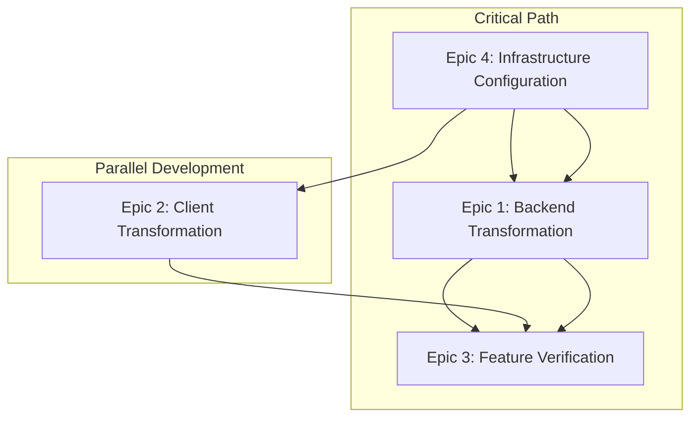

# Epic Technical Breakdown Documentation

## 📋 Document Information
- **Version**: v2.0
- **Source**: Based on user stories and technical implementation experience
- **Update Date**: December 2024
- **Target Audience**: Technical teams, architects, developers

---

## 🎯 Epic Implementation Overview

### Epic Dependency Graph



### Implementation Timeline
1. **Phase 1**: Epic 4 - Infrastructure Setup (1-2 days)
2. **Phase 2**: Epic 1 & Epic 2 - Parallel Development (3-5 days)
3. **Phase 3**: Epic 3 - Integration Testing (2-3 days)

---

## 🔧 Epic 4: Supabase Infrastructure Configuration & Security Setup

### Implementation Priority: 🔴 Highest (Blocking other Epics)

### Technical Implementation Details

#### 4.1 Supabase Project Creation & Configuration
**Implementation Complexity**: ⭐⭐  
**Estimated Time**: 30 minutes

```bash
# Project configuration checklist
✅ Project name: cursor-remote-supabase
✅ Region selection: Nearest geographical location
✅ Database password: Strong password setup
✅ API key acquisition: anon key + service_role key
```

#### 4.2 Database Table Structure Creation
**Implementation Complexity**: ⭐⭐⭐  
**Estimated Time**: 1 hour

```sql
-- Commands table creation script
CREATE TABLE public.commands (
    id uuid DEFAULT gen_random_uuid() NOT NULL,
    created_at timestamp with time zone DEFAULT now() NOT NULL,
    command_text text NOT NULL,
    status text DEFAULT 'pending'::text NOT NULL,
    user_id uuid,
    raw_command jsonb,
    attempts integer DEFAULT 0,
    last_error text,
    CONSTRAINT commands_pkey PRIMARY KEY (id),
    CONSTRAINT commands_status_check CHECK ((status = ANY (ARRAY['pending'::text, 'processing'::text, 'completed'::text, 'error'::text])))
);

-- Results table creation script
CREATE TABLE public.results (
    id uuid DEFAULT gen_random_uuid() NOT NULL,
    created_at timestamp with time zone DEFAULT now() NOT NULL,
    command_id uuid NOT NULL,
    result_text text,
    error_message text,
    is_error boolean DEFAULT false NOT NULL,
    raw_result jsonb,
    CONSTRAINT results_pkey PRIMARY KEY (id),
    CONSTRAINT results_command_id_fkey FOREIGN KEY (command_id) REFERENCES public.commands(id) ON DELETE CASCADE
);

-- Index creation
CREATE INDEX idx_commands_status ON public.commands(status);
CREATE INDEX idx_commands_created_at ON public.commands(created_at);
CREATE INDEX idx_results_command_id ON public.results(command_id);
```

#### 4.3 Row Level Security (RLS) Policy Configuration
**Implementation Complexity**: ⭐⭐⭐⭐  
**Estimated Time**: 2 hours

```sql
-- Enable RLS
ALTER TABLE public.commands ENABLE ROW LEVEL SECURITY;
ALTER TABLE public.results ENABLE ROW LEVEL SECURITY;

-- Commands table policies
-- Allow anonymous users to insert new commands
CREATE POLICY "Allow anon insert commands" ON public.commands
    FOR INSERT TO anon WITH CHECK (true);

-- Allow anonymous users to select their own commands (simplified for initial phase)
CREATE POLICY "Allow anon select commands" ON public.commands
    FOR SELECT TO anon USING (true);

-- Allow service role full access
CREATE POLICY "Allow service_role full access commands" ON public.commands
    FOR ALL TO service_role USING (true) WITH CHECK (true);

-- Results table policies
-- Allow service role to insert results
CREATE POLICY "Allow service_role insert results" ON public.results
    FOR INSERT TO service_role WITH CHECK (true);

-- Allow anonymous users to select results
CREATE POLICY "Allow anon select results" ON public.results
    FOR SELECT TO anon USING (true);

-- Allow service role full access
CREATE POLICY "Allow service_role full access results" ON public.results
    FOR ALL TO service_role USING (true) WITH CHECK (true);
```

#### 4.4 Real-time Feature Configuration
**Implementation Complexity**: ⭐⭐⭐  
**Estimated Time**: 1 hour

```sql
-- Enable real-time for commands table
ALTER PUBLICATION supabase_realtime ADD TABLE public.commands;

-- Enable real-time for results table
ALTER PUBLICATION supabase_realtime ADD TABLE public.results;
```

### Testing Checklist for Epic 4
- [ ] Project creation successful
- [ ] Database tables created with correct structure
- [ ] RLS policies working as expected
- [ ] API keys configured correctly
- [ ] Real-time functionality enabled
- [ ] Connection tests from both client and server

---

## ⚙️ Epic 1: Backend Core Transformation & Supabase Integration

### Implementation Priority: 🟡 High (Depends on Epic 4)

### Technical Implementation Details

#### 1.1 Supabase Client Initialization
**Implementation Complexity**: ⭐⭐⭐  
**Estimated Time**: 2 hours

```javascript
// Advanced Supabase service implementation
class SupabaseService {
    constructor() {
        this.supabase = null;
        this.isConnected = false;
        this.reconnectAttempts = 0;
        this.maxReconnectAttempts = 5;
    }

    async initialize() {
        const { createClient } = require('@supabase/supabase-js');
        
        const supabaseUrl = process.env.SUPABASE_URL;
        const supabaseKey = process.env.SUPABASE_SERVICE_KEY;
        
        if (!supabaseUrl || !supabaseKey) {
            throw new Error('Missing Supabase configuration');
        }

        this.supabase = createClient(supabaseUrl, supabaseKey, {
            auth: {
                persistSession: false
            },
            realtime: {
                params: {
                    eventsPerSecond: 10
                }
            }
        });

        return await this.testConnection();
    }

    async testConnection() {
        try {
            // Test connection
            const { data, error } = await this.supabase
                .from('commands')
                .select('count')
                .limit(1);
            
            if (error) throw error;
            console.log('✅ Supabase connection established');
            return true;
        } catch (error) {
            console.error('❌ Supabase connection failed:', error);
            return false;
        }
    }
}
```

#### 1.2 Real-time Subscription Implementation
**Implementation Complexity**: ⭐⭐⭐⭐  
**Estimated Time**: 3 hours

```javascript
// Complex real-time subscription logic
async setupCommandSubscription() {
    this.commandSubscription = this.supabase
        .channel('public:commands')
        .on(
            'postgres_changes',
            {
                event: 'INSERT',
                schema: 'public',
                table: 'commands',
                filter: 'status=eq.pending'
            },
            this.handleNewCommand.bind(this)
        )
        .on('subscribe', (status) => {
            console.log('📡 Commands subscription status:', status);
        })
        .on('error', (error) => {
            console.error('❌ Subscription error:', error);
            this.reconnectSubscription();
        })
        .subscribe();
}

async handleNewCommand(payload) {
    const command = payload.new;
    console.log(`🎯 Processing new command: ${command.id}`);
    
    try {
        // Update status to processing
        await this.updateCommandStatus(command.id, 'processing');
        
        // Execute AppleScript
        const result = await this.executeAppleScript(command.command_text);
        
        // Store result
        await this.storeResult(command.id, result);
        
        // Update status to completed
        await this.updateCommandStatus(command.id, 'completed');
        
    } catch (error) {
        console.error(`❌ Command execution failed:`, error);
        
        // Store error result
        await this.storeResult(command.id, error.message, true);
        
        // Update status to error
        await this.updateCommandStatus(command.id, 'error', error.message);
    }
}
```

#### 1.3 Error Handling and Reconnection Mechanism
**Implementation Complexity**: ⭐⭐⭐⭐⭐  
**Estimated Time**: 4 hours

```javascript
// Advanced error handling and reconnection
class ConnectionManager {
    constructor(supabaseService) {
        this.supabaseService = supabaseService;
        this.retryCount = 0;
        this.maxRetries = 5;
        this.retryDelay = 1000; // 1 second
        this.isConnected = false;
    }

    async ensureConnection() {
        if (!this.isConnected) {
            await this.reconnectWithBackoff();
        }
    }

    async reconnectWithBackoff() {
        for (let i = 0; i < this.maxRetries; i++) {
            try {
                const connected = await this.supabaseService.testConnection();
                if (connected) {
                    this.isConnected = true;
                    this.retryCount = 0;
                    console.log('✅ Reconnection successful');
                    return true;
                }
            } catch (error) {
                console.error(`❌ Reconnection attempt ${i + 1} failed:`, error);
            }
            
            // Exponential backoff
            const delay = this.retryDelay * Math.pow(2, i);
            await new Promise(resolve => setTimeout(resolve, delay));
        }
        
        console.error('❌ Max reconnection attempts reached');
        return false;
    }
}
```

#### 1.4 AppleScript Integration Layer
**Implementation Complexity**: ⭐⭐⭐  
**Estimated Time**: 2 hours

```javascript
// Enhanced AppleScript execution
class AppleScriptExecutor {
    constructor() {
        this.osascript = require('node-osascript');
    }

    async executeCommand(commandText) {
        // Command parsing and validation
        const parsedCommand = this.parseCommand(commandText);
        
        // Generate appropriate AppleScript
        const script = this.generateAppleScript(parsedCommand);
        
        return new Promise((resolve, reject) => {
            this.osascript.execute(script, (err, result) => {
                if (err) {
                    console.error('AppleScript execution error:', err);
                    reject(new Error(`AppleScript failed: ${err.message}`));
                } else {
                    console.log('✅ AppleScript executed successfully');
                    resolve(result);
                }
            });
        });
    }

    parseCommand(commandText) {
        // Extract command type and parameters
        // Support different command formats
        const patterns = {
            chat: /^(chat|ask|agent):\s*(.+)/i,
            action: /^(new_chat|clear_chat|save|run)$/i
        };

        for (const [type, pattern] of Object.entries(patterns)) {
            const match = commandText.match(pattern);
            if (match) {
                return { type, content: match[2] || match[1] };
            }
        }

        // Default to chat command
        return { type: 'chat', content: commandText };
    }

    generateAppleScript(parsedCommand) {
        const { type, content } = parsedCommand;
        
        switch (type) {
            case 'chat':
                return `
                    tell application "Cursor"
                        activate
                        delay 0.5
                        
                        -- Send chat message
                        keystroke "${content.replace(/"/g, '\\"')}"
                        key code 36 -- Enter key
                        
                        delay 2
                        
                        -- Get response (simplified)
                        return "Chat command sent successfully"
                    end tell
                `;
            
            case 'action':
                return this.generateActionScript(content);
            
            default:
                throw new Error(`Unknown command type: ${type}`);
        }
    }

    generateActionScript(action) {
        const actionScripts = {
            new_chat: `
                tell application "Cursor"
                    activate
                    key code 15 using {command down} -- Cmd+R for new chat
                    return "New chat created"
                end tell
            `,
            clear_chat: `
                tell application "Cursor"
                    activate
                    key code 15 using {command down, shift down} -- Clear chat
                    return "Chat cleared"
                end tell
            `,
            save: `
                tell application "Cursor"
                    activate
                    key code 1 using {command down} -- Cmd+S
                    return "File saved"
                end tell
            `,
            run: `
                tell application "Cursor"
                    activate
                    key code 13 using {command down} -- Cmd+Enter to run
                    return "Code executed"
                end tell
            `
        };

        return actionScripts[action] || `return "Unknown action: ${action}"`;
    }
}
```

### Testing Checklist for Epic 1
- [ ] Supabase client initialization successful
- [ ] Real-time subscription working
- [ ] Command status updates functioning
- [ ] AppleScript execution working
- [ ] Error handling and logging
- [ ] Reconnection mechanisms tested

---

## 📱 Epic 2: Client Core Transformation & Supabase Integration

### Implementation Priority: 🟡 High (Depends on Epic 4, Parallel with Epic 1)

### Technical Implementation Details

#### 2.1 Client Supabase SDK Integration
**Implementation Complexity**: ⭐⭐⭐  
**Estimated Time**: 2 hours

```javascript
// Enhanced client-side Supabase integration
class CursorRemoteClient {
    constructor() {
        this.supabase = null;
        this.subscriptions = new Map();
        this.connectionStatus = 'disconnected';
    }

    async initialize() {
        const { createClient } = supabase;
        
        this.supabase = createClient(
            window.SUPABASE_URL,
            window.SUPABASE_ANON_KEY,
            {
                realtime: {
                    params: {
                        eventsPerSecond: 10
                    }
                }
            }
        );

        // Test connection
        try {
            const { data, error } = await this.supabase
                .from('commands')
                .select('count')
                .limit(1);
            
            if (error) throw error;
            
            this.connectionStatus = 'connected';
            this.updateConnectionStatus(true);
            console.log('✅ Client Supabase connection established');
            
        } catch (error) {
            this.connectionStatus = 'error';
            this.updateConnectionStatus(false);
            console.error('❌ Client connection failed:', error);
            throw error;
        }
    }

    updateConnectionStatus(isConnected) {
        const statusElement = document.getElementById('connection-status');
        if (statusElement) {
            statusElement.textContent = isConnected ? '🟢 Connected' : '🔴 Disconnected';
            statusElement.className = isConnected ? 'status-connected' : 'status-disconnected';
        }
    }
}
```

#### 2.2 Command Sending Implementation
**Implementation Complexity**: ⭐⭐⭐  
**Estimated Time**: 1.5 hours

```javascript
// Advanced command sending with validation and tracking
async sendCommand(commandText) {
    if (!commandText.trim()) {
        throw new Error('Command cannot be empty');
    }

    // Validate command
    this.validateCommand(commandText);

    // Create loading state
    const loadingId = this.showLoadingMessage(`Sending: ${commandText}`);

    try {
        // Insert command into database
        const { data, error } = await this.supabase
            .from('commands')
            .insert([
                {
                    command_text: commandText,
                    status: 'pending',
                    raw_command: {
                        timestamp: new Date().toISOString(),
                        user_agent: navigator.userAgent,
                        session_id: this.getSessionId()
                    }
                }
            ])
            .select();

        if (error) throw error;

        const commandId = data[0].id;
        console.log(`📤 Command sent: ${commandId}`);

        // Subscribe to status updates for this command
        await this.subscribeToCommandStatus(commandId, commandText, loadingId);

        return commandId;

    } catch (error) {
        this.removeLoadingMessage(loadingId);
        this.showErrorMessage(`Failed to send command: ${error.message}`);
        throw error;
    }
}

validateCommand(commandText) {
    // Command length validation
    if (commandText.length > 1000) {
        throw new Error('Command too long (max 1000 characters)');
    }

    // Basic security validation
    const dangerousPatterns = [
        /rm\s+-rf\s+\//, // Dangerous system commands
        /sudo\s+/, // Sudo commands
        /[;&|].*rm\s+/, // Command injection attempts
    ];

    for (const pattern of dangerousPatterns) {
        if (pattern.test(commandText)) {
            throw new Error('Command contains potentially dangerous operations');
        }
    }
}
```

#### 2.3 Real-time Status Monitoring
**Implementation Complexity**: ⭐⭐⭐⭐  
**Estimated Time**: 3 hours

```javascript
// Advanced status monitoring with fallback mechanisms
async subscribeToCommandStatus(commandId, originalCommand, loadingId) {
    const subscriptionKey = `command_${commandId}`;
    
    // Create subscription
    const subscription = this.supabase
        .channel(`command_status_${commandId}`)
        .on(
            'postgres_changes',
            {
                event: 'UPDATE',
                schema: 'public',
                table: 'commands',
                filter: `id=eq.${commandId}`
            },
            this.handleCommandStatusUpdate.bind(this, commandId, originalCommand, loadingId)
        )
        .on('subscribe', (status) => {
            console.log(`📡 Subscribed to command ${commandId}: ${status}`);
        })
        .on('error', (error) => {
            console.error(`❌ Subscription error for ${commandId}:`, error);
            // Implement fallback polling
            this.startFallbackPolling(commandId, originalCommand, loadingId);
        })
        .subscribe();

    this.subscriptions.set(subscriptionKey, subscription);

    // Set timeout for subscription
    setTimeout(() => {
        this.handleCommandTimeout(commandId, originalCommand, loadingId);
    }, 60000); // 60 second timeout
}

async handleCommandStatusUpdate(commandId, originalCommand, loadingId, payload) {
    const updatedCommand = payload.new;
    console.log(`📊 Command ${commandId} status: ${updatedCommand.status}`);

    switch (updatedCommand.status) {
        case 'processing':
            this.updateLoadingMessage(loadingId, `Processing: ${originalCommand}`);
            break;
            
        case 'completed':
            await this.handleCompletedCommand(commandId, originalCommand, loadingId);
            break;
            
        case 'error':
            await this.handleErrorCommand(commandId, originalCommand, loadingId);
            break;
    }
}

async handleCompletedCommand(commandId, originalCommand, loadingId) {
    this.removeLoadingMessage(loadingId);
    
    try {
        // Get result from results table
        const { data, error } = await this.supabase
            .from('results')
            .select('*')
            .eq('command_id', commandId)
            .single();

        if (error) throw error;

        if (data.is_error) {
            this.showErrorMessage(`Command failed: ${data.error_message}`);
        } else {
            this.showSuccessMessage(data.result_text || 'Command completed successfully');
        }

    } catch (error) {
        console.error('Error fetching result:', error);
        this.showErrorMessage('Failed to retrieve command result');
    } finally {
        this.cleanupSubscription(commandId);
    }
}

startFallbackPolling(commandId, originalCommand, loadingId) {
    const pollInterval = setInterval(async () => {
        try {
            const { data, error } = await this.supabase
                .from('commands')
                .select('status')
                .eq('id', commandId)
                .single();

            if (error) throw error;

            if (data.status !== 'pending' && data.status !== 'processing') {
                clearInterval(pollInterval);
                await this.handleCommandStatusUpdate(commandId, originalCommand, loadingId, {
                    new: data
                });
            }

        } catch (error) {
            console.error('Polling error:', error);
            clearInterval(pollInterval);
        }
    }, 3000); // Poll every 3 seconds

    // Clean up polling after timeout
    setTimeout(() => {
        clearInterval(pollInterval);
    }, 60000);
}
```

### Testing Checklist for Epic 2
- [ ] Client initialization working
- [ ] Command sending functionality
- [ ] Real-time status updates
- [ ] Result retrieval and display
- [ ] Error handling and user feedback
- [ ] Connection status monitoring

---

## 🧪 Epic 3: Core Feature Migration Verification & End-to-End Testing

### Implementation Priority: 🟢 Medium (Depends on Epic 1 & 2)

### Testing Strategy

#### 3.1 Automated Testing Framework
**Implementation Complexity**: ⭐⭐⭐  
**Estimated Time**: 4 hours

```javascript
// Comprehensive testing framework
class CursorRemoteTestSuite {
    constructor() {
        this.testResults = [];
        this.testTimeout = 30000; // 30 seconds
    }

    async runAllTests() {
        console.log('🧪 Starting comprehensive test suite...');
        
        const testSuites = [
            this.testDatabaseConnection,
            this.testCommandFlow,
            this.testErrorHandling,
            this.testPerformance,
            this.testSecurity
        ];

        for (const testSuite of testSuites) {
            try {
                await testSuite.call(this);
            } catch (error) {
                console.error(`❌ Test suite failed: ${testSuite.name}`, error);
            }
        }

        this.generateTestReport();
    }

    async testCommandFlow() {
        const testCases = [
            { command: 'chat: Hello world', expectedType: 'success' },
            { command: 'agent: Help me debug this code', expectedType: 'success' },
            { command: 'ask: What is this function doing?', expectedType: 'success' },
            { command: 'new_chat', expectedType: 'action' },
            { command: 'save', expectedType: 'action' }
        ];

        for (const testCase of testCases) {
            await this.testSingleCommand(testCase);
        }
    }

    async testSingleCommand(testCase) {
        const startTime = Date.now();
        
        try {
            // Send command
            const commandId = await this.sendTestCommand(testCase.command);
            
            // Wait for completion
            const result = await this.waitForCommandCompletion(commandId);
            
            const duration = Date.now() - startTime;
            
            this.testResults.push({
                command: testCase.command,
                status: 'passed',
                duration,
                result: result
            });
            
            console.log(`✅ Test passed: ${testCase.command} (${duration}ms)`);
            
        } catch (error) {
            this.testResults.push({
                command: testCase.command,
                status: 'failed',
                error: error.message,
                duration: Date.now() - startTime
            });
            
            console.error(`❌ Test failed: ${testCase.command}`, error);
        }
    }
}
```

#### 3.2 Performance Testing
**Implementation Complexity**: ⭐⭐⭐⭐  
**Estimated Time**: 3 hours

```javascript
// Performance testing and benchmarking
class PerformanceTester {
    async runPerformanceTests() {
        const tests = [
            this.testResponseTime,
            this.testConcurrentCommands,
            this.testMemoryUsage,
            this.testLongRunningStability
        ];

        for (const test of tests) {
            await test.call(this);
        }
    }

    async testResponseTime() {
        const iterations = 10;
        const responseTimes = [];

        for (let i = 0; i < iterations; i++) {
            const startTime = performance.now();
            
            await this.sendTestCommand(`Performance test ${i}`);
            
            const endTime = performance.now();
            responseTimes.push(endTime - startTime);
        }

        const avgResponseTime = responseTimes.reduce((a, b) => a + b, 0) / responseTimes.length;
        const maxResponseTime = Math.max(...responseTimes);
        const minResponseTime = Math.min(...responseTimes);

        console.log(`📊 Response Time Stats:
            Average: ${avgResponseTime.toFixed(2)}ms
            Min: ${minResponseTime.toFixed(2)}ms
            Max: ${maxResponseTime.toFixed(2)}ms`);

        // Validate against requirements
        if (avgResponseTime > 10000) { // 10 seconds
            throw new Error(`Average response time too high: ${avgResponseTime}ms`);
        }
    }

    async testConcurrentCommands() {
        const concurrencyLevel = 5;
        const promises = [];

        const startTime = performance.now();

        for (let i = 0; i < concurrencyLevel; i++) {
            promises.push(this.sendTestCommand(`Concurrent test ${i}`));
        }

        await Promise.all(promises);

        const totalTime = performance.now() - startTime;
        console.log(`⚡ Concurrent Commands Test: ${concurrencyLevel} commands in ${totalTime.toFixed(2)}ms`);
    }
}
```

### Manual Testing Checklist

```markdown
### Core Functionality Testing
- [ ] Chat mode commands (chat, agent, ask)
- [ ] Action commands (new chat, clear chat, save code, run code)
- [ ] Error handling and user prompts
- [ ] Command history

### Performance Testing
- [ ] Single command response time < 10 seconds
- [ ] Concurrent command processing capability
- [ ] Long-term operational stability
- [ ] Memory usage monitoring

### Security Testing
- [ ] RLS policy effectiveness
- [ ] API key security
- [ ] Data access permission control
- [ ] Injection attack protection

### Compatibility Testing
- [ ] Safari mobile
- [ ] Chrome mobile
- [ ] Firefox mobile
- [ ] Various network conditions
```

### Key Testing Scenarios
1. **Happy Path**: Normal command send-process-return result flow
2. **Error Path**: Invalid commands, network interruptions, server errors
3. **Edge Cases**: Long commands, special characters, concurrent requests
4. **Performance Benchmarks**: Response time, throughput, resource usage

---

## 📊 Overall Implementation Plan

### Resource Allocation Recommendations
- **Backend Development**: 40% (Epic 1)
- **Frontend Development**: 30% (Epic 2)
- **Infrastructure**: 15% (Epic 4)
- **Testing & Verification**: 15% (Epic 3)

### Risk Mitigation Strategies

#### High-Risk Items
1. **Real-time Subscription Stability**
   - Mitigation: Detailed testing under various network conditions
   - Backup Plan: Implement polling backup mechanism

2. **RLS Policy Complexity**
   - Mitigation: Phased implementation, loose then strict
   - Backup Plan: Document all policy decisions

3. **Performance Regression**
   - Mitigation: Establish performance baselines and monitoring
   - Backup Plan: Prepare performance optimization solutions

### Success Criteria
- ✅ All original functionality works normally
- ✅ Response times meet user expectations
- ✅ System stability not below original level
- ✅ Security significantly improved
- ✅ Code quality and maintainability enhanced

---

## 🔄 Future Optimization Directions

### Short-term Optimization (1-2 weeks)
- Performance tuning and monitoring improvements
- Error handling mechanism optimization
- User experience detail improvements

### Medium-term Planning (1-3 months)
- User authentication system integration
- Multi-user data isolation
- Advanced analytics and monitoring

### Long-term Vision (3-6 months)
- Mobile application development
- Cloud function integration
- Intelligent command suggestions

---

*Document prepared by Technical Architect Timmy | Last updated: December 2024*
