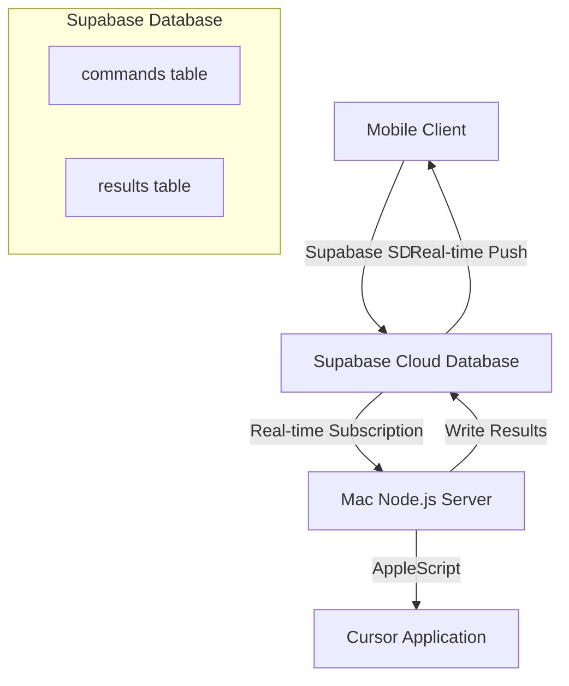

# Product Requirements Document (PRD): Cursor Remote Control Solution - Supabase Migration

## 📋 Document Version Information
- **Version**: v2.0 (Integrated version)
- **Update Date**: December 2024
- **Status**: Confirmed
- **Source**: Integrated from .ai/prd.md, .ai/project_brief_supabase_migration.md, etc.

---

## 1. Project Overview

### 1.1 Project Background
The current Cursor remote control project sends commands through mobile client, passes them via Redis Pub/Sub to Node.js server on Mac, controls Cursor application through AppleScript, and returns results through Redis.

### 1.2 Core Pain Points
- **Security risks**: Redis requires public network access, bringing data exposure and unauthorized access risks
- **Configuration complexity**: Need to configure port forwarding, firewall rules and other complex network settings
- **Maintenance difficulties**: Local Redis service stability and monitoring issues

### 1.3 Solution Goals
Use Supabase to replace Redis Pub/Sub communication mechanism, achieving:
- ✅ Enhanced security - No need for local service public network exposure
- ✅ Simplified configuration - Leveraging BaaS platform's ready-made services
- ✅ Structured storage - PostgreSQL database supports complex queries
- ✅ Future expansion - Foundation for user authentication, file storage and other features

### 1.4 Project Scope

#### 🎯 In Scope
- Use Supabase real-time database to replace Redis Pub/Sub functionality
- Migrate client and server communication logic to Supabase SDK
- Design `commands` and `results` data tables to support existing functionality
- Configure Supabase Row Level Security (RLS) policies to protect data
- Ensure all existing core functionality works normally

#### 🚫 Out of Scope (Not included in this iteration)
- New user features (except those necessary for migration)
- Major client UI/UX modifications
- Comprehensive integration of other Supabase services (Auth, Storage, etc.)
- User authentication feature implementation

---

## 2. Users and Use Cases

### 2.1 Target Users
- **Primary users**: Individual developer use
- **User characteristics**: Familiar with technical tools, need convenience of remote IDE control
- **Usage environment**: Mobile client + Mac desktop Cursor

### 2.2 Core User Scenarios (Maintaining existing functionality)

#### Scenario 1: Remote Chat Control
- Users send natural language chat commands to Cursor through mobile
- Support different chat modes (chat, agent, ask)
- Receive Cursor reply results in real-time

#### Scenario 2: Remote Operation Control
- Users send action commands (new chat, clear chat, save code, run code)
- Server executes corresponding operations through AppleScript
- Return operation results or confirmation information

#### Scenario 3: Error Handling
- When command execution fails, users can receive clear error information
- Support retry mechanism and error logging

---

## 3. Technical Solution

### 3.1 Overall Architecture Changes

### 3.2 Data Model Design

#### 3.2.1 `commands` Table
| Field Name | Type | Description | Constraints |
|------------|------|-------------|-------------|
| id | UUID | Primary key, unique identifier | PK, auto-generated |
| created_at | TIMESTAMPTZ | Creation timestamp | Auto-generated, now() |
| command_text | TEXT | Command content (user input natural language) | NOT NULL |
| status | TEXT | Command status | NOT NULL, default 'pending' |
| user_id | UUID | User identifier (placeholder) | Nullable, for future user authentication |
| raw_command | JSONB | Structured raw command data | Nullable |
| attempts | INTEGER | Retry count | Default 0 |
| last_error | TEXT | Last error message | Nullable |

**Status Value Definitions**:
- `pending`: Pending processing
- `processing`: Processing
- `completed`: Completed
- `error`: Execution error

#### 3.2.2 `results` Table
| Field Name | Type | Description | Constraints |
|------------|------|-------------|-------------|
| id | UUID | Primary key, unique identifier | PK, auto-generated |
| created_at | TIMESTAMPTZ | Creation timestamp | Auto-generated, now() |
| command_id | UUID | Related commands table command ID | NOT NULL, FK |
| result_text | TEXT | Execution result content | Cursor direct output |
| error_message | TEXT | Error message | Used when error occurs |
| is_error | BOOLEAN | Whether error result | NOT NULL, default FALSE |
| raw_result | JSONB | Structured raw result data | Nullable, for future analysis |

### 3.3 Security Strategy

#### 3.3.1 Access Permission Design
- **Server-side (service_role)**:
  - Read commands records
  - Update commands status
  - Create results records
- **Client-side (anon/authenticated)**:
  - Create commands records
  - Read commands and results records
  - Initially adopt relatively permissive RLS policies

#### 3.3.2 Data Isolation Strategy
- **Current version**: No strict user data isolation implementation
- **user_id field**: Only as placeholder for future functionality
- **Shared mode**: Client may serve multiple users or anonymous users

---

## 4. Detailed Functional Requirements

### 4.1 Server-side Requirements
- **US1.1**: Real-time subscribe to new commands with status='pending' in commands table
- **US1.2**: Update status to 'processing' after receiving command
- **US1.3**: Store results in results table after execution completion
- **US1.4**: Update commands table status to 'completed' or 'error'
- **US1.5**: Create commands data table structure
- **US1.6**: Create results data table structure
- **US1.7**: Handle and record execution error information

### 4.2 Client-side Requirements
- **US2.1**: Write user commands to commands table
- **US2.2**: Real-time subscribe to commands status changes
- **US2.3**: Get and display execution results from results table
- **US2.4**: Clearly display error information to users

### 4.3 Core Functionality Verification
- **US3.1**: End-to-end functionality verification of chat and action commands
- **US3.2**: Complete process correctness and response speed testing
- **US3.3**: Various error scenario handling verification

### 4.4 Infrastructure Configuration
- **US4.1**: Create Supabase project
- **US4.2**: Create data tables and relationship configuration
- **US4.3**: Configure server-side API keys
- **US4.4**: Configure client-side anonymous keys
- **US4.5**: Set up preliminary RLS policies

---

## 5. Non-Functional Requirements

### 5.1 Performance Requirements
- **Response time**: Meet basic experience for personal use, no obvious lag
- **Real-time**: Message delivery delay within acceptable range
- **Quantitative goals**: No specific quantitative metrics in initial phase

### 5.2 Reliability Requirements
- **Error handling**: Commands and results without loss or error
- **Network recovery**: Handle occasional network interruptions
- **Retry mechanism**: Basic failure retry, keep simple initially

### 5.3 Security Requirements
- **Core goal**: Solve Redis public network exposure problem
- **Basic security**: Correctly use security mechanisms provided by Supabase
- **Data protection**: Control data access through RLS policies

### 5.4 Maintainability Requirements
- **Clear code**: Clear structure easy to understand and modify
- **Complete documentation**: Supabase configuration and RLS policies documented
- **Debug support**: Provide necessary logs and debug information

### 5.5 Scalability Requirements
- **Current scope**: Designed for personal use, no consideration of large-scale concurrency
- **Data retention**: Follow Supabase default policies, adjust as needed later

---

## 6. Success Criteria

### 6.1 Functional Success Criteria
- ✅ All existing core functionality works normally after Supabase migration
- ✅ Complete mobile remote control Cursor operation functionality
- ✅ Complete execution process of chat commands and action commands
- ✅ Correct transmission and display of error information

### 6.2 Technical Success Criteria
- ✅ Redis public network exposure problem completely solved
- ✅ System security significantly improved compared to before
- ✅ Developers can clearly understand and maintain new solution
- ✅ Supabase integration solution runs stably

### 6.3 User Experience Criteria
- ✅ Response speed meets personal use requirements
- ✅ Core interaction flow remains unchanged
- ✅ Error prompts clear and friendly
- ✅ No obvious functional degradation

---

## 7. Key Assumptions and Constraints

### 7.1 Technical Assumptions
- Supabase real-time database can meet current performance requirements
- PostgreSQL database suitable for storing command and result data
- Supabase SDK can work stably on both client and server sides
- AppleScript and Node.js integration method remains unchanged

### 7.2 Business Assumptions
- Users accept migration changes from Redis to Supabase
- Existing core user scenarios don't need adjustment
- Data volume and concurrency under personal use scenarios within controllable range
- No immediate need to implement multi-user and user authentication features

### 7.3 Project Constraints
- This migration focuses on communication mechanism replacement, doesn't change core business logic
- UI/UX modifications limited to minimum necessary scope
- Doesn't include deep integration of Supabase advanced features
- Success criteria mainly qualitative assessment, no quantitative metrics for now

---

## 8. Risk Assessment and Mitigation

### 8.1 Technical Risks
- **Risk**: Supabase performance doesn't meet real-time requirements
- **Mitigation**: Prototype validation and performance testing before formal migration

- **Risk**: Functional interruption during data migration
- **Mitigation**: Develop detailed migration plan and rollback solution

### 8.2 Integration Risks
- **Risk**: Difficulty integrating Supabase SDK with existing code
- **Mitigation**: Phased code refactoring, keep original architecture as backup

- **Risk**: Security issues due to incorrect RLS policy configuration
- **Mitigation**: Thorough security policy testing, conservative configuration initially

### 8.3 User Experience Risks
- **Risk**: Degraded response speed after migration
- **Mitigation**: Performance benchmark testing and optimization adjustments

- **Risk**: Existing functionality unstable under new architecture
- **Mitigation**: Comprehensive end-to-end testing validation

---

## 9. Future Roadmap

### 9.1 Post-MVP Features (Out of scope)
- User authentication system based on Supabase Auth
- Multi-user support and data isolation
- Structured command_text and result_text
- Performance and scalability optimization
- Supabase Storage integration for file storage
- Advanced error handling and user feedback mechanisms

### 9.2 Technical Debt Management
- Optimize database query performance
- Improve error logging and monitoring
- Code refactoring and architecture optimization
- Continuous improvement of security policies

---

## 10. Appendix

### 10.1 Related Documents
- [Complete Architecture Document](../COMPLETE_ARCHITECTURE.md)
- [Detailed User Stories List](USER_STORIES.md)
- [Technical Implementation Epics](EPICS_BREAKDOWN.md)

### 10.2 Decision Records
- Reasons for choosing Supabase over other BaaS platforms
- Data model design considerations
- Security trade-offs in RLS policies

### 10.3 Glossary
- **BaaS**: Backend as a Service
- **RLS**: Row Level Security
- **AppleScript**: macOS automation scripting language
- **Pub/Sub**: Publish/Subscribe messaging pattern

---

*Document prepared by Product Manager Bill | Last updated: December 2024*
