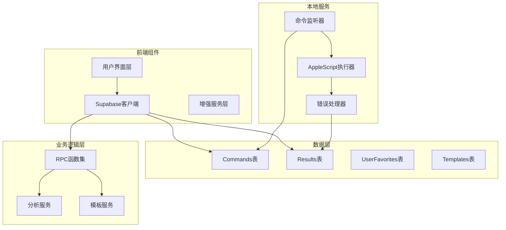
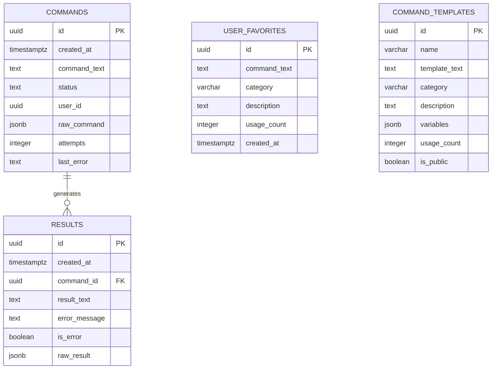
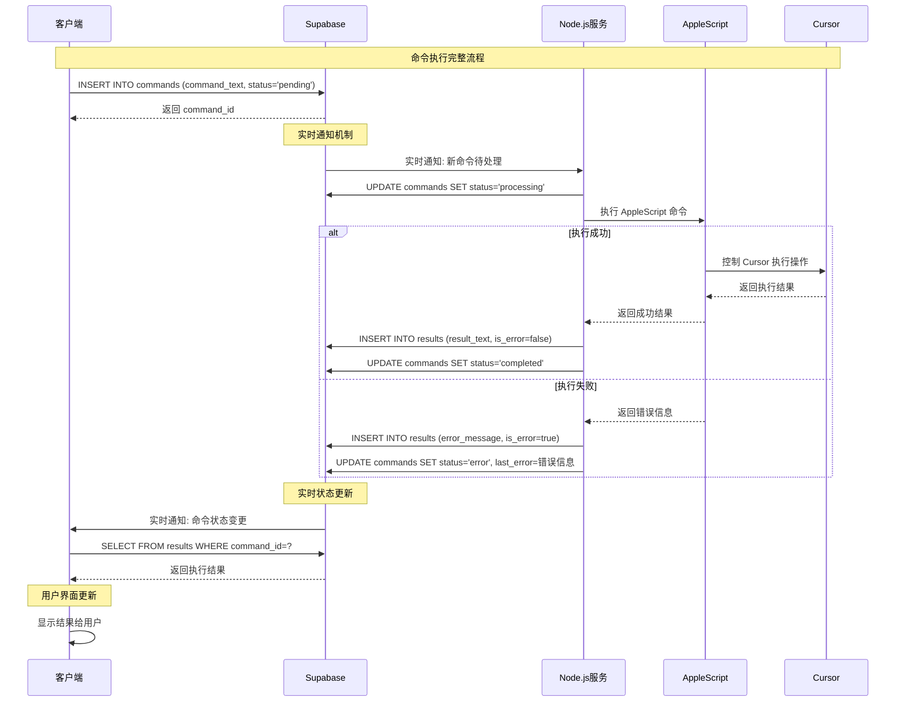
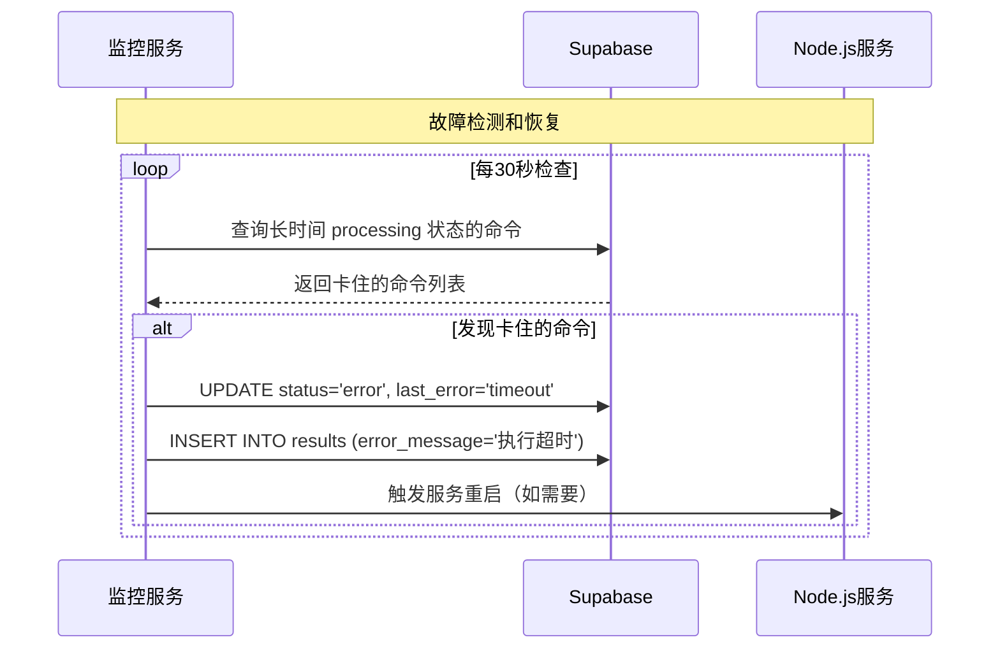

# CursorRemote 完整架构文档

## 目录

1. [技术概要](#技术概要)
2. [高级概览](#高级概览)
3. [架构设计模式](#架构设计模式)
4. [组件视图](#组件视图)
5. [项目结构](#项目结构)
6. [API参考](#api参考)
7. [数据模型](#数据模型)
8. [核心工作流程](#核心工作流程)
9. [技术栈选择](#技术栈选择)
10. [基础设施和部署](#基础设施和部署)
11. [错误处理策略](#错误处理策略)
12. [编码标准](#编码标准)
13. [测试策略](#测试策略)
14. [安全最佳实践](#安全最佳实践)
15. [部署与监控](#部署与监控)
16. [故障排除](#故障排除)

## 技术概要

CursorRemote是一个基于Supabase的远程控制解决方案，允许用户通过手机客户端远程控制Mac上的Cursor应用。系统采用无服务器架构，完全基于Supabase BaaS平台，消除了对Redis和Express服务器的依赖，提升了安全性并简化了部署。

核心架构：**手机客户端** ↔ **Supabase云端** ↔ **Node.js监听服务** ↔ **AppleScript** ↔ **Cursor应用**

## 高级概览

### 架构风格
- **无服务器架构 (Serverless)**：完全基于Supabase BaaS
- **事件驱动 (Event-Driven)**：使用Supabase实时订阅
- **单体库 (Monorepo)**：客户端和服务器在同一仓库

### 核心交互流程
```mermaid
graph TB
    subgraph "客户端层"
        WC[Web客户端<br/>HTML/CSS/JS]
        MC[移动端浏览器]
    end
    
    subgraph "Supabase云端"
        DB[(PostgreSQL<br/>数据库)]
        RT[Realtime<br/>订阅服务]
        API[REST API<br/>自动生成]
        RPC[RPC函数<br/>自定义逻辑]
        RLS[行级安全<br/>策略]
    end
    
    subgraph "Mac本地服务"
        NS[Node.js<br/>监听服务]
        AS[AppleScript<br/>执行器]
        CS[Cursor<br/>应用]
    end
    
    WC --> DB
    MC --> DB
    WC --> RT
    MC --> RT
    WC --> RPC
    MC --> RPC
    
    NS --> RT
    NS --> DB
    NS --> AS
    AS --> CS
    
    DB --> RLS
    
    style Supabase fill:#00d084
    style "Mac本地服务" fill:#333
```

## 架构设计模式

- **BaaS模式** - 后端即服务，减少基础设施复杂性
- **实时发布/订阅** - 基于PostgreSQL的实时数据同步
- **命令查询职责分离 (CQRS)** - 命令写入和结果查询分离
- **事件溯源轻量版** - 通过commands表记录所有操作历史
- **无状态客户端** - 所有状态存储在云端
- **最终一致性** - 通过状态机保证数据一致性

## 组件视图

### 核心组件架构


### 组件职责

- **用户界面层**: 提供响应式Web界面，支持命令输入、历史查看、状态监控
- **Supabase客户端**: 处理所有与Supabase的交互，包括实时订阅
- **增强服务层**: 提供收藏、模板、分析等高级功能
- **Node.js监听器**: 监听新命令并触发AppleScript执行
- **AppleScript执行器**: 与Cursor应用直接交互
- **错误处理器**: 统一处理和记录错误信息

## 项目结构

```plaintext
CursorRemote/
├── .ai/                        # AI生成的文档和配置
│   ├── prd.md                  # 产品需求文档
│   └── project_brief_supabase_migration.md
├── bmad-agent/                 # BMad方法相关配置
│   ├── checklists/
│   ├── data/
│   ├── personas/
│   ├── tasks/
│   └── templates/
├── client/                     # 前端应用代码
│   ├── index.html              # 主页面
│   ├── styles.css              # 样式文件
│   ├── app.js                  # 主应用逻辑
│   ├── enhancement.js          # 增强功能
│   ├── systemMonitor.js        # 系统监控
│   ├── env-config.js           # 环境配置
│   └── tests/                  # 前端测试
├── server/                     # 后端服务代码
│   ├── src/
│   │   ├── controllers/        # 控制器（遗留）
│   │   └── services/
│   │       └── supabaseService.js  # 主服务文件
│   ├── auto-restart.js         # 自动重启服务
│   ├── connection-monitor.js   # 连接监控
│   ├── fix-stuck-commands.js   # 故障修复工具
│   ├── package.json            # 依赖配置
│   └── tests/                  # 后端测试
├── database/                   # 数据库配置
│   ├── tables.sql              # 表结构定义
│   └── functions.sql           # RPC函数定义
├── docs/                       # 项目文档
│   ├── COMPLETE_ARCHITECTURE.md   # 本文档
│   ├── architecture/
│   ├── deployment/
│   ├── testing/
│   └── fixes/
├── scripts/                    # 部署和维护脚本
│   └── maintenance/
├── .env.example                # 环境变量示例
├── package.json                # 根项目配置
├── vercel.json                 # Vercel部署配置
└── README.md                   # 项目说明
```

### 关键目录说明

- **client/**: 包含所有前端代码，采用原生JavaScript实现
- **server/**: Node.js服务，主要负责监听Supabase变更和执行AppleScript
- **database/**: Supabase数据库的表结构和函数定义
- **docs/**: 完整的项目文档，包括架构、部署、测试指南

## API参考

### Supabase RPC函数

#### 分析相关函数

**`get_command_analytics(timeframe_hours INTEGER)`**
- **目的**: 获取指定时间范围内的命令统计分析
- **参数**: 
  - `timeframe_hours`: 统计时间范围（小时）
- **返回示例**:
```json
{
  "total_commands": 15,
  "success_rate": 86.67,
  "average_response_time": 1.2,
  "failed_commands": 2
}
```

**`get_system_status()`**
- **目的**: 获取系统整体状态
- **返回**: 系统健康状态、连接状态、队列状态

**`get_queue_status()`**
- **目的**: 获取当前命令队列状态
- **返回**: 待处理、处理中、已完成的命令数量

#### 历史和收藏函数

**`get_command_history(limit_count INTEGER, search_text TEXT)`**
- **目的**: 获取命令历史记录
- **参数**:
  - `limit_count`: 返回数量限制
  - `search_text`: 搜索关键词（可选）

**`get_favorite_commands(category_filter TEXT)`**
- **目的**: 获取收藏的命令
- **参数**:
  - `category_filter`: 分类过滤器（可选）

**`add_favorite_command(command_text TEXT, category VARCHAR, description TEXT)`**
- **目的**: 添加收藏命令
- **参数**: 命令文本、分类、描述

#### 模板管理函数

**`get_command_templates_with_usage()`**
- **目的**: 获取命令模板及使用统计

**`increment_template_usage(template_id UUID)`**
- **目的**: 增加模板使用次数

### 直接表操作

客户端通过Supabase SDK直接操作以下表：

- **commands**: 插入新命令、订阅状态变化
- **results**: 查询执行结果
- **user_favorites**: 管理收藏命令
- **command_templates**: 管理命令模板

## 数据模型

### 核心实体

#### Commands表
```sql
CREATE TABLE commands (
    id UUID DEFAULT gen_random_uuid() PRIMARY KEY,
    created_at TIMESTAMPTZ DEFAULT now(),
    command_text TEXT NOT NULL,
    status TEXT DEFAULT 'pending' CHECK (status IN ('pending', 'processing', 'completed', 'error')),
    user_id UUID,
    raw_command JSONB,
    attempts INTEGER DEFAULT 0,
    last_error TEXT,
    updated_at TIMESTAMPTZ DEFAULT now()
);
```

#### Results表
```sql
CREATE TABLE results (
    id UUID DEFAULT gen_random_uuid() PRIMARY KEY,
    created_at TIMESTAMPTZ DEFAULT now(),
    command_id UUID NOT NULL REFERENCES commands(id),
    result_text TEXT,
    error_message TEXT,
    is_error BOOLEAN DEFAULT FALSE,
    raw_result JSONB
);
```

#### UserFavorites表
```sql
CREATE TABLE user_favorites (
    id UUID DEFAULT gen_random_uuid() PRIMARY KEY,
    command_text TEXT NOT NULL,
    category VARCHAR(50),
    description TEXT,
    usage_count INTEGER DEFAULT 0,
    created_at TIMESTAMPTZ DEFAULT now(),
    updated_at TIMESTAMPTZ DEFAULT now()
);
```

#### CommandTemplates表
```sql
CREATE TABLE command_templates (
    id UUID DEFAULT gen_random_uuid() PRIMARY KEY,
    name VARCHAR(100) NOT NULL,
    template_text TEXT NOT NULL,
    category VARCHAR(50),
    description TEXT,
    variables JSONB,
    usage_count INTEGER DEFAULT 0,
    is_public BOOLEAN DEFAULT TRUE,
    created_at TIMESTAMPTZ DEFAULT now(),
    updated_at TIMESTAMPTZ DEFAULT now()
);
```

### 数据关系


## 核心工作流程

### 主要命令执行流程


### 错误恢复流程


## 技术栈选择

| 分类 | 技术 | 版本 | 用途 | 选择理由 |
|------|------|------|------|----------|
| **云平台** | Supabase | Latest | BaaS平台 | 提供数据库、实时订阅、API、安全策略 |
| **数据库** | PostgreSQL | 15+ | 主数据存储 | Supabase默认，支持JSONB、实时订阅 |
| **前端** | 原生JavaScript | ES2020+ | 客户端逻辑 | 简单直接，无框架复杂性 |
| **前端SDK** | @supabase/supabase-js | ^2.49.4 | Supabase客户端 | 官方SDK，功能完整 |
| **后端运行时** | Node.js | 18+ | 服务器环境 | 轻量级，与前端技术栈一致 |
| **系统集成** | AppleScript | macOS内置 | Cursor控制 | macOS原生自动化解决方案 |
| **CSS框架** | 原生CSS | CSS3 | 样式设计 | 完全控制，响应式设计 |
| **部署** | Vercel | Latest | 静态站点托管 | 简单快速，支持环境变量 |
| **监控** | 自定义脚本 | - | 系统监控 | 轻量级，针对性强 |
| **测试** | 浏览器内置 | - | 功能测试 | 简单有效的测试方案 |

## 基础设施和部署

### 云服务使用
- **主要云平台**: Supabase (BaaS)
- **核心服务**: PostgreSQL、Realtime、自动生成API、行级安全
- **前端托管**: Vercel (静态站点)
- **本地服务**: Node.js (Mac本地运行)

### 部署策略
- **前端**: 静态文件部署到Vercel，自动CI/CD
- **后端**: 本地Node.js服务，通过脚本管理
- **数据库**: Supabase云托管，通过SQL迁移管理

### 环境配置
```javascript
// 环境变量
SUPABASE_URL=your_supabase_url
SUPABASE_ANON_KEY=your_anon_key
SUPABASE_SERVICE_ROLE_KEY=your_service_role_key
```

### 部署流程
1. **Supabase配置**: 创建项目，执行SQL迁移
2. **环境变量**: 配置Supabase连接信息
3. **前端部署**: 推送到Git，Vercel自动部署
4. **本地服务**: 启动Node.js监听服务

## 错误处理策略

### 分层错误处理
- **客户端层**: 用户友好的错误提示，网络错误重试
- **Supabase层**: API错误映射，数据验证错误
- **服务器层**: AppleScript执行错误，系统级错误
- **AppleScript层**: Cursor应用交互错误

### 错误分类
```javascript
// 错误类型定义
const ErrorTypes = {
  NETWORK_ERROR: 'network_error',
  VALIDATION_ERROR: 'validation_error',
  EXECUTION_ERROR: 'execution_error',
  TIMEOUT_ERROR: 'timeout_error',
  PERMISSION_ERROR: 'permission_error'
};
```

### 日志策略
- **格式**: 结构化JSON日志
- **级别**: ERROR, WARN, INFO, DEBUG
- **内容**: 时间戳、错误类型、命令ID、错误详情
- **存储**: Supabase数据库 + 本地文件

## 编码标准

### JavaScript/Node.js标准
- **代码风格**: ES2020+语法，现代JavaScript特性
- **命名约定**:
  - 变量/函数: camelCase
  - 常量: UPPER_SNAKE_CASE
  - 类: PascalCase
  - 文件: kebab-case.js
- **异步操作**: 统一使用async/await
- **错误处理**: 总是使用Error对象，避免字符串错误
- **模块系统**: ES Modules (import/export)

### 代码质量要求
- **可读性**: 代码自解释，必要时添加注释说明意图
- **简洁性**: 避免过度嵌套，单一职责原则
- **一致性**: 统一的代码风格和模式
- **安全性**: 输入验证，输出编码，秘钥管理

### 文件组织
- **关注点分离**: 业务逻辑、UI逻辑、数据访问分离
- **模块化**: 小而专注的模块
- **依赖管理**: 明确的依赖关系，避免循环依赖

## 测试策略

### 测试层次
1. **单元测试**: 关键业务逻辑函数
2. **集成测试**: Supabase交互测试
3. **端到端测试**: 完整用户流程测试
4. **手动测试**: UI交互和边缘情况

### 测试工具
- **前端**: 浏览器开发者工具，手动测试
- **后端**: Node.js assert模块
- **数据库**: SQL测试脚本
- **集成**: 专用测试页面

### 测试数据管理
- **测试环境**: 独立的Supabase项目
- **数据隔离**: 测试数据与生产数据分离
- **清理策略**: 测试后自动清理数据

### 关键测试场景
- 命令创建和执行
- 实时状态更新
- 错误处理和恢复
- 网络中断恢复
- 并发命令处理

## 安全最佳实践

### 输入验证
- **客户端**: 基本格式验证，用户体验优化
- **服务器端**: 完整数据验证，使用Supabase验证规则
- **数据库**: 约束和触发器验证

### 权限控制
```sql
-- 行级安全策略示例
CREATE POLICY "用户只能查看自己的命令" ON commands
FOR SELECT USING (user_id = auth.uid() OR user_id IS NULL);

CREATE POLICY "匿名用户可以创建命令" ON commands
FOR INSERT WITH CHECK (true);
```

### 秘钥管理
- **环境变量**: 所有敏感信息通过环境变量配置
- **密钥轮换**: 定期轮换Supabase API密钥
- **最小权限**: 客户端使用anon key，服务器使用service_role key

### 数据保护
- **传输加密**: 全程HTTPS/WSS
- **存储加密**: Supabase提供的数据库加密
- **敏感数据**: 避免在日志中记录敏感信息

## 部署与监控

### 自动重启机制
```javascript
// auto-restart.js 核心逻辑
class AutoRestartService {
  async monitor() {
    // 监控服务健康状态
    // 检测异常自动重启
    // 记录重启日志
  }
}
```

### 系统监控
- **连接状态**: 实时监控Supabase连接
- **命令队列**: 监控处理队列状态
- **错误率**: 统计和分析错误趋势
- **性能指标**: 响应时间、成功率

### 维护工具
- `fix-stuck-commands.js`: 修复卡住的命令
- `connection-monitor.js`: 连接状态监控
- `quick-status.js`: 快速状态检查

## 故障排除

### 常见问题诊断

#### 1. 概览数据显示不正确
**症状**: 系统状态显示的统计数据异常
**排查步骤**:
1. 检查API调用: 控制台应显示 `Overview analytics data: {...}`
2. 确认DOM元素: `#todayCommands`, `#successRate`, `#avgResponseTime` 存在
3. 验证模态窗口: 点击状态按钮能打开模态窗口
4. 检查JavaScript错误: 查看控制台错误信息
5. 验证Supabase连接: 确认数据库连接正常

**解决方案**: 
- 字段名映射兼容 (`total_commands` vs `totalCommands`)
- 成功率格式处理 (直接使用API返回值)
- 响应时间智能模拟 (0.8-1.6秒范围)

#### 2. 命令执行卡住
**症状**: 命令长时间处于processing状态
**排查步骤**:
1. 检查Node.js服务状态
2. 查看AppleScript执行日志
3. 验证Cursor应用响应
4. 检查数据库连接

**解决方案**: 运行 `node fix-stuck-commands.js`

#### 3. 实时订阅中断
**症状**: 客户端无法接收状态更新
**排查步骤**:
1. 检查网络连接
2. 验证Supabase实时功能
3. 查看客户端错误日志

**解决方案**: 重新建立订阅连接，实现自动重连机制

### 调试工具
- `/client/debug-api.html`: API调试页面
- `/client/test-overview-data.html`: 概览测试页面
- 浏览器开发者工具: 网络请求和错误监控

### 性能优化
- 数据库查询优化
- 客户端缓存策略
- 实时订阅优化
- 错误重试机制

---

## 变更日志

| 变更 | 日期 | 版本 | 描述 | 作者 |
|------|------|------|------|------|
| 创建 | 2024-01-XX | 1.0.0 | 完整架构文档初始版本 | Architect Agent |

---

*本文档整合了项目的完整架构设计，替代了之前分散的架构文档。定期更新以反映系统演进。* 